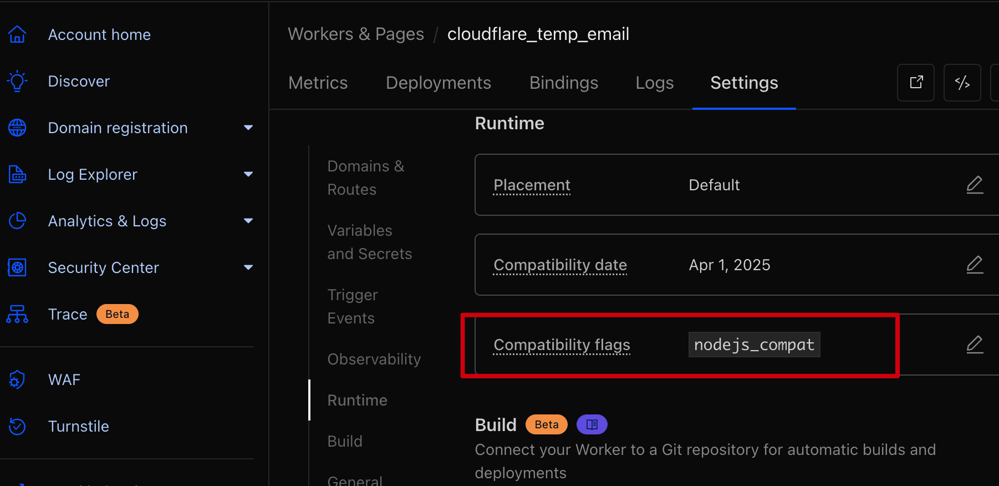

<!-- markdownlint-disable-file MD004 MD024 MD033 MD034 MD036 -->
# CHANGE LOG

<p align="center">
  <a href="CHANGELOG.md">中文</a> |
  <a href="CHANGELOG_EN.md">English</a>
</p>

## v1.11.0(main)

- fix: |Worker| 删除用户时在同一 D1 事务清理外部账号关联的邮件，避免同名邮箱被重新接入后看到已删除用户的历史；管理员角色令牌不再绕过 x-admin-auth 口令门。

- fix: |OAuth| 登录链接改由 Worker 生成并返回随机 state，修复前端未传 state 导致 OAuth 登录始终失败，并避免调用方预测或复用状态。

- fix: |Worker| 用户删除与地址转移改为 D1 原子生命周期：删除会同时清理角色、passkey、外部邮箱凭据和绑定关系，已删除用户的 JWT 立即失效；地址转移不再存在中途删除导致邮箱丢失的窗口。

- fix: |Worker| 用户与地址密码改为服务端加盐 PBKDF2 存储：前端登录/注册/改密改为通过 HTTPS 发送原始密码，旧 SHA-256 客户端仍可登录并在成功认证后迁移；不再把可重放的客户端摘要直接当作数据库密码。

- fix: |Worker| 发送配额改为 D1 持久化 reservation：配额槽位与发送尝试绑定在同一条原子写入中，失败请求与 Worker 崩溃留下的活动 reservation 由请求路径/定时任务可恢复释放，避免短时间失败重试把每日计数永久耗尽。

- feat: |聚合器| 新增 Hotmail / Outlook.com **个人号（MSA）** OAuth2/XOAUTH2 接入：微软已对所有租户禁用 IMAP 基础认证（含 App Password 部分账号不可用），`aggregator/oauth.py` 新增 `msa_access_token`（走 `/consumers` 租户 + 公开客户端，无需 client_secret，scope `IMAP.AccessAsUser.All offline_access`），复用既有 `oauth2_login` XOAUTH2 通道收信；`normalize_provider` 把 `hotmail`/`outlook_personal` 归一化为 `msa`，`provider` 三写法都可用；worker `user_api/mail_accounts.ts` 的 `OAUTH_PROVIDERS` 加入 `msa`/`hotmail`/`outlook_personal`；新增 `aggregator/scripts/msa_authorize.py`（Device Code Flow）一次性产出 `refresh_token` 引导脚本；`config.example.json` 与部署 `README` 补充个人号接入；组织号仍走 `outlook`+secret 不破坏。测试新增 MSA 分支 10 项，聚合器 126 通过 / worker 127 通过 / vitepress 构建通过。

- feat: |Worker| Phase 0 外部邮箱连接测试与立即同步接口：新增按用户归属校验的 `test-connection` / `sync` 路由；当前 Worker 无 VPS/队列派发能力时明确返回 `501 unsupported`，绝不伪造连接成功或 queued。

### Features

- fix: |Aggregator| Phase 0 外部邮箱配置闭环：remote accounts 映射并保留 IMAP/POP3 host、port、SSL/STLS 与 folders，畸形 folders 安全回退为 `INBOX`，确保 AccountConfig/sync 使用远端 POP3 参数
- feat: |Frontend/CI| 前端现代化与 awesome-ui-kit 组件体系深度重构：全量装配 `ThemeToggle`, `StatusIndicator`, `ThinkingBlock`, `StreamMarkdown`, `ChatPromptInput`, `PromptChips`, `MessageActionToolbar` 等 14 个原子单文件基元；邮件阅读器新增 AI 智能助理抽屉与提取回复草稿能力；`AiExtractInfo` 重构验证码大字与一键复制；`Header` 与 `Appearance` 集成 Auto/Light/Dark 三态主题切换；新增 GitHub Actions `.github/workflows/deploy.yml` 自动化 CI 门禁与 push main 自动构建部署至 pxed（nginx :3301）
- feat: |Worker| Add Bearer API-key authentication for the unified mailbox API, including readonly source/account scoping and admin access
- feat: |Worker| 新增统一收件箱完整查询端点：`GET /api/unified/emails?source=&account=&unread=&q=`（`q=` 全文搜索）、`GET /api/unified/count?source=&unread=`、`GET /api/unified/verifcodes?addr=&fresh=`、`POST /api/unified/emails/:id/read`（admin API-key 专属），并提供验证码提取纯函数与验证码邮件查询；新增 `POST /admin/unified/keys`（x-admin-auth 保护）用于创建带 rolereadonly/admin、来源/账号白名单的 API key，明文 key 仅创建时返回一次（one-mail 统一收件箱）
- feat: |Worker| one-mail 统一收件箱新增 90 天已读邮件保留清理：`scheduled` 任务每次运行时删除 `is_read=1` 且 `received_at` 早于 90 天前的邮件，并同步删除关联的 R2 附件键（若配置了 `ATTACHMENTS` bucket）（one-mail M5 保留清理）
- feat: |Frontend| 前后端彻底分离：前端改为唯一形态「跨域直连 Worker」——`VITE_API_BASE` 指向 worker 自定义域名 `mail-api.mangoqwq.cc.cd`，`vite.config.js` 新增 dev `server.proxy`（本地 `pnpm dev` 直连 `127.0.0.1:8787`，不再 404）；删除已废弃的 Pages Functions 代理拓扑（`pages/functions/_middleware.js` + `pages/wrangler.toml` 的 `[[services]] BACKEND` + `frontend_pagefunction_deploy.yaml`），`API_PATHS` 收敛为 `worker/src/worker.ts` 单一来源；`pages/wrangler.toml` 退化为纯静态托管（见 `docs/superpowers/specs/2026-08-21-frontend-backend-separation.md`）
- feat: |Frontend| 新增统一收件箱前端页面（路由 `/unified`、`/unified/:id`）：Tailwind + awesome-ui 组件装配，四个视图——① 邮件列表（分页 + `source`/`account_id`/`unread` 过滤 + `q` 关键词搜索，点击行进详情）② 验证码聚合视图（`addr` + `fresh` 时间窗，`code` 高亮一键复制）③ 聚合器运行状态卡片（从 `/api/unified/count` + 列表推导总数/未读/来源/账号，含 `StatusIndicator` 在线徽标）④ API-key 设置（localStorage 保存、测试连接、管理员密码新建 key，明文仅显示一次）。接入 Tailwind v4（`@tailwindcss/vite` + `@custom-variant dark` class 策略，dark 变体跟随全站 `useDark`）；`src/api/index.js` 新增 `unifiedFetch`（仅注入 `Authorization: Bearer <unifiedApiKey>`，复用 `safeBearerHeader`，不携带站点 JWT）与 `api.unified.*` / `api.admin.createUnifiedKey`；store 新增 `unifiedApiKey`；顶部导航新增「统一收件箱」入口；`unified` i18n namespace（zh/en）；文档补 frontend-dev.md「统一收件箱前端页面」小节
- feat: |统一收件箱| 接入现有用户账户体系：登录用户通过 `x-user-token` 访问统一收件箱，`ADMIN_USER_ROLE` 管理员查看全部邮件，普通用户按 `users_address → address.name → emails.to_addr` 只查看自己绑定地址的邮件；未登录仍兼容 Bearer API-key 程序化访问，列表、详情、验证码、计数和标记已读统一执行作用域校验；前端未登录且无 key 时显示登录入口。
- chore: |统一收件箱| 账户体系上线配置（生产）：Worker `wrangler.toml` 新增 `USER_ROLES`（`admin`/`user` 两角色）与 `ADMIN_USER_ROLE=admin`；通过 D1 `settings.user_settings` 开启用户注册（`enable:true, enableMailVerify:false`，未绑定 KV 故关闭邮箱验证）；创建管理员账户 `admin@mangoqwq.com` 并写入 `user_roles.role_text=admin`。前端改用 `pnpm build:pages`（`.env.pages` 指向 `mail-api.mangoqwq.cc.cd`）重建并上传 pxed nginx `/opt/one-mail-frontend/dist`。
- feat: |统一收件箱| 放开多人前的注册防滥用加固：①绑定 KV namespace（`binding=KV`），注册 `verify_code` 验证码改 KV 存储并在 `enableMailVerify:true` 下走「邮箱验证码 + Turnstile」门控；②`/user_api/register` 与 `/user_api/verify_code` 新增 KV 计数限流（`checkRegistrationRateLimit`，5 次/分钟/IP，超限 429，fail-open），替代在本账号不解析的 Cloudflare ratelimit binding；③开启 `CF_TURNSTILE_SITE_KEY`/`CF_TURNSTILE_SECRET_KEY`/`ENABLE_GLOBAL_TURNSTILE_CHECK`，登录与注册均校验 Turnstile；④`DISABLE_ANONYMOUS_USER_CREATE_EMAIL=true` 关闭匿名建址，使 `maxAddressCount` 限额对所有人生效；⑤D1 `settings.user_settings` 设 `verifyMailSender=noreply@mangoqwq.cc.cd`，经 `SEND_MAIL` 发验证码。新增 i18n `RateLimitExceededMsg`（zh/en）。
- feat: |统一收件箱| 普通用户自助接入外部邮箱归集（Gmail/QQ/163/Outlook/任意 IMAP·POP3）：用户在「我的邮箱」页填入外部邮箱的 IMAP/POP3 主机·端口·邮箱地址·应用密码，Worker 用 AES-GCM（`MAIL_CRED_ENCRYPTION_KEY`，32 字节 base64）加密后存 D1 新表 `user_mail_accounts.cred_enc`，明文绝不落盘；聚合器每轮从 `GET /admin/unified/mail_accounts`（`x-admin-auth` 保护）拉取 `enabled=1` 的用户邮箱并解密凭据，与 admin `config.json` 账号合并去重后逐个 sync（单账号失败不阻塞其他）。新增 `user_api/cred_crypto.ts`（AES-GCM 加解密，无密钥 fail-closed）、`user_api/mail_accounts.ts`（用户 CRUD + 按 to_addr 自动绑定 + 每用户 5 个上限 + 5 次/分钟限流）、`aggregator/remote_accounts.py`（拉取并映射为 `AccountConfig`）；`userAddressScope`（`api_keys.ts`）UNION `user_mail_accounts.username`，使隔离直接源自用户接入记录、不依赖 `users_address.address_id` UNIQUE 约束——两人接入同名外部邮箱各自隔离。前端新增 `UserMailAccounts.vue`（路由 tab `user_mail_accounts`、Naive UI 表单）、`api.userMailAccounts.*`、i18n `views.user.UserMailAccounts`/`views.User.user_mail_accounts`（zh/en）。测试：worker `cred_crypto` 6 项（往返/随机 iv/篡改拒绝/缺密钥 fail-closed/错密钥拒绝/Unicode）、aggregator `remote_accounts` 4 项、全 32+56+60 通过。文档补 `guide/worker-vars.md`（`MAIL_CRED_ENCRYPTION_KEY`）与 `guide/feature/user-external-mail`（zh/en）。
- fix: |统一收件箱| 外部邮箱归集 review 加固（code review 后修复）：①**可达性**（`normalize.py`）`to_addr` 恒等于 `account.username`，不再取 To: 头——alias（`user+tag@`）、邮件列表转发、bcc、多收件人场景下 `to_addr` 不再与归属作用域失配成孤儿邮件，每封抓回来的邮件都能被邮箱主人看到（原 To: 头仍在 `headers_json` 完整保留）；隔离层本就拦住跨租户串看，此处修的是可达性而非泄漏。②**状态回灌**（`mail_accounts.ts` 新增 `reportStatus` + `unified/index.ts` 挂 `POST /admin/unified/mail_accounts/:id/status`，`x-admin-auth` 保护）聚合器每轮 sync 后回写 `last_sync_at`/`last_error`，解密失败也回写——用户填错 app-password 时「我的邮箱」页直接看到原因，不再默默不收信；`main.py` 按 `(host, username)` 去重（替代单 username，避免 admin 与用户接入同邮箱时凭据争抢）。③**地址页守卫**（`admin_api/address_api.ts`）列表/计数排除 `source_meta='external'` 引用行、删除接口拒删外部引用行——避免管理员误把用户接入的外部邮箱当本站地址删除而破坏归属隔离；`email/index.ts` 未知地址拦截亦排除外部引用行（防御性）。④**健壮性**（`mail_accounts.ts`）`safeFolders` 对畸形 `folders_json` try/catch 兜底 `["INBOX"]`，防单条坏数据 500 整列；create 时校验 `folders` 为数组、`port` 上限 65535、`label` 先 `String()` 防非 string 崩溃。⑤**测试**新增 `api_keys.test.mjs` 隔离回归 3 项（`userAddressScope` 逗号列表 / `__none__` fail-closed 哨兵 / 两人同名外部邮箱隔离）、`remote_accounts` `report_sync_status` 4 项（成功/失败/404 静默/网络异常不抛）；`aggregator/conftest.py` path shim 使新 clone `pytest` 开箱可跑。全 21+64 通过。
- fix: |统一收件箱| Turnstile 盾收紧到只守注册接口（2026-08-22）：登录盾摩擦过大（`site_login`/`address_login`/`credential_login` 三处 + 前端 4 个登录页），注册才是真正需要防刷的入口。①`wrangler.toml` 关闭 `ENABLE_GLOBAL_TURNSTILE_CHECK`（`true`→`false`）——`open_api/auth.ts` 三处登录校验改由 `isGlobalTurnstileEnabled` 门控、自动失效，前端 4 个登录页的 `<Turnstile v-if="openSettings.enableGlobalTurnstileCheck">` 自动消失；②建址接口的盾属硬编码移除——`new_address.ts` 删 `checkCfTurnstile` 校验与 `cf_token`（生产建址已受 `DISABLE_ANONYMOUS_USER_CREATE_EMAIL` 强制登录 + `maxAddressCount` 数量限制 + `checkRegistrationRateLimit` 限流三重防护，盾多余）、`telegram_api/miniapp.ts` `newTelegramAddress` 同样移除（Telegram 建址本走 initData HMAC 签名校验，已是强鉴权）；`Login.vue` 匿名建址表单的无条件 `<Turnstile>` 删除。③**注册盾完整保留**——`user_api/user.ts` `verifyCode` 无条件校验 Turnstile、`register` 在 `!enableMailVerify` 时校验（开启邮箱验证时由 `verify_code` 兜底），passkey 注册受 `isGlobalTurnstileEnabled` 门控随之关闭。线上实测：`/user_api/verify_code`、`/user_api/register` 无 `cf_token` 均 400（盾生效）；`/api/site_login`、`/api/address_login` 无 `cf_token` 返回登录失败文案（`Invalid address credential` / `Password login is disabled`）而非 `Turnstile check failed`，盾已去。前端新 bundle 已部署 pxed `/opt/one-mail-frontend/dist`。
- fix: |文档/部署| 修项目回顾发现的 3 处文档-代码-部署不一致：①**虚构端点 `GET /api/unified/search`**——README（zh/en）、CHANGELOG（zh/en）都列了这个路由，但代码从未实现，搜索实为 `GET /api/unified/emails?q=`（`unified_query.ts`）。改文档为 `q=` 参数（README 端点表合并到 `emails` 行、CHANGELOG 修端点清单），确认前端无调用方依赖。②**R2 附件清理文档过度承诺**——README 说「同步清理关联的 R2 附件键」，但 `wrangler.toml` 与 `.template` 均无 R2 binding、`normalize.py`/`unified_store.ts` 不写 `r2_key`（`retention.ts:10` 注释自承），实际保留清理只删 D1 行。改 README（zh/en）为「D1-only，R2 为预留逻辑」，`retention.ts` 的 `if(bucket)` 守卫本就安全（空 binding 即 no-op）保留不动；CHANGELOG 历史条目用「*若配置 ATTACHMENTS bucket*」措辞本就条件式、不属杜撰，保留。③**部署拓扑文档误导**——`aggregator/deploy/README.md` 指示 `cp one-mail-agg.{service,timer} /etc/systemd/system/` + `systemctl enable --now one-mail-agg.timer`，但 pxed 从未用 systemd 跑过（`disabled`、且 pxed 不以 systemd 为 PID 1），真实运行靠 supervisord `program:one-mail-agg` → `agg-loop.sh`（每 300s）。更糟的是 `agg-loop.sh` 与 supervisor conf 之前**根本没进仓库**，clone 后无法复现部署。修复：删仓库内 `one-mail-agg.service`/`.timer` 死文件 + pxed 上 `/etc/systemd/system/one-mail-agg.*`；新增 `aggregator/deploy/agg-loop.sh`（+x）与 `one-mail-agg.supervisor.conf` 入仓库；重写 `deploy/README.md` 为 supervisord 流程；README（zh/en）「supervisor/systemd」改「supervisord」。已 scp 同步到 pxed 并 `supervisorctl reread/update`（「No config updates to processes」，pid 不变），聚合器循环实测仍正常 sync（qq-main IMAP / mail163-main POP3）。
- feat: |统一收件箱| 外部邮箱接入配额角色化（Part 3 配额收紧）：①**外部邮箱接入上限从硬编码 5 移到 `role_address_config.maxMailAccountCount`**——与 `maxAddressCount` 同源可配，admin 后台「角色地址配置」页新增「外部邮箱上限（0 为不限制）」列（`RoleAddressConfig.vue`），缺失/负数回退全局默认 5、0 表示不限，与地址配额同口径。新增 `worker/src/quota.ts` 的 `getMaxMailAccountCount`（平行 `getMaxAddressCount`，读 `role_address_config[role].maxMailAccountCount`），`mail_accounts.ts` `create` 用之替换硬编码 `MAX_MAIL_ACCOUNTS_PER_USER`；`admin_user_api.ts` `saveRoleAddressConfig` 校验新字段非负；`models/index.ts` `RoleConfig` 加 `maxMailAccountCount?`。②**前端** `RoleAddressConfig.vue` 加 `NInputNumber` 列、i18n `maxMailAccountCount`/`notConfiguredMailAccount`（zh/en）、`roleConfigDesc` 补说明外部邮箱独立计数。③**可测性**：三个配额函数抽到 `quota.ts`（只引 `hono`，零相对 import，符合项目「被 node --test 加载模块不带相对路径」约定——`utils.ts` 经 `gzip.ts`→`./models` 的 type-only 值 import 在 `--experimental-strip-types` 下会 SyntaxError），`utils.ts` re-export 保持调用方 `import from "../utils"` 不破坏。新增 `utils_quota.test.mjs` 6 项回归（串台计数 2 项 + 角色化配额 4 项），全 52 通过。文档补 `guide/feature/user-external-mail.md`（「接入数量配额」一节，说明 `maxMailAccountCount` 角色配置与外部邮箱独立计数，zh/en）。
- fix: |统一收件箱| 修地址配额串台 bug（Part 3 配额收紧）：`isAddressCountLimitReached`（`quota.ts`）计数查询原本 `SELECT COUNT(*) FROM users_address WHERE user_id=?` **不过滤 `source_meta`**，导致用户接入外部邮箱时 `ensureExternalBinding` 写入的 `source_meta='external'` 占位绑定行**偷占 `maxAddressCount` 配额**——与 `mail_accounts.ts` 顶部「外部邮箱独立计数、不消耗地址配额」的注释承诺相反（一个 user 接 5 个外部邮箱后 `maxAddressCount=5` 用满，无法再建任何本站地址）。修复：计数改为 `JOIN address a ON a.id=ua.address_id WHERE (a.source_meta IS NULL OR a.source_meta != 'external')`，排除外部引用行。与 `admin_api/address_api.ts` list/count、`email/index.ts` 未知地址拦截的「外部引用行不计本站地址」既有口径一致；用 `JOIN` 而非 `LEFT JOIN`（`address` 行被误删而 `users_address` 残留时 `JOIN` 不计数，不惩罚用户）。受益调用方：`new_address.ts`、`user_api/bind_address.ts`（建址/转移）、`mail_accounts.ts`，无需各处改。回归测试锁定：3 本站地址 + 2 外部绑定的用户在 `maxAddressCount=5` 下放行（计 3 不是 5）。
- docs: |README| I2 修正虚构的 /admin/unified/accounts 端点为真实的 /admin/unified/mail_accounts 与 /status 回写

### Bug Fixes

- fix: |前端| security（R3/OAuth）：回调 state 回发 + CSPRNG 生成——`UserOauth2Callback.vue` 的 `POST /user_api/oauth2/callback` body 现固定携带 `state`（优先 `route.query.state`，缺失回退 store 的 `userOauth2SessionState` 会话态；两者皆无则发空串交由后端 fail-closed 拒绝，不再遗留旧会话换 code 路径）；`UserLogin.vue` 的 OAuth state 生成从 `Math.random().toString(36).substring(2)` 换成 `crypto.getRandomValues` 32 字节 hex（弱随机 state 可被猜测用于 CSRF 换 code）。与 worker 侧 R3（callback 无条件校验 state）配套收口
- fix: |前端| security（H4）：发信预览 v-html 统一消毒——`views/index/SendMail.vue`、`views/admin/SendMail.vue` 的 `v-html="sendMailModel.content"` 裸渲染改为 `safePreviewContent`（统一走项目级 `src/utils/sanitize-html.js` 的 `sanitizeHtml`：DOMPurify 默认白名单 + `ALLOWED_URI_REGEXP` 收紧为 `http/https/mailto`，剥除 `javascript:`/`data:text/html`/`form action` 与事件属性）；`SendBox.vue` 已引同一 `sanitizeHtml`（此前为裸 DOMPurify 调用，现自动继承严格 URI 策略）。富文本编辑器 `naive-input` 可粘贴外部 HTML（如"回信引用原始邮件"），后端 `send_mail` 按 `is_html` 原样发送，本层是发送前唯一防线。测试：新增 `sanitizeHtml` 严格策略单测（javascript: href / form action / data:text/html / 事件属性 均剥、http 保留），`sanitize-html.test.js` 69→76
- fix: |前端| security（R1 CRITICAL）：主邮件正文 XSS 通道关闭——`store` 的 `autoLoadRemoteImages` 默认从 `true` 改为 `false`，且 `MailContentRenderer.vue` 的 `processedMail` **不再因该开关跳过消毒**：任何开关取值下正文一律先过 `sanitizeHtmlMail`（DOMPurify + 远程资源阻断 + 严格 URI 正则），`autoLoadRemoteImages`/per-mail `showRemoteImages` 仅在"已消毒 HTML"上放开远程 ``（`blockRemoteContent(html, { allowRemote: true })`，只放行 IMG src 且仍受 `ALLOWED_URI_REGEXP` 约束——脚本/事件属性/`javascript:`/CSS url() 与默认路径同样剥除），杜绝 `<script>//<a href=javascript:>` 经主文档（shadowRoot.innerHTML / iframe srcdoc）执行。**行为变化**：未开启开关的邮件正文中远程图片不再自动加载（显示遮挡提示 + "加载图片" 按钮仍在），用户可在外观设置/单封点击恢复加载；改开关不再构成绕过消毒的新攻击面。测试：新增 `blockRemoteContent(…,{allowRemote:true})` 断言（恶意脚本仍剥、远程 img 保留、state 不泄漏跨调用）
- fix: |Aggregator| H1 未知 SIZE 跳过不推进水位——修复整批新邮件静默永久丢失：`fetch_new_messages` 对 `RFC822.SIZE` 缺失（服务器不支持 SIZE 属性，imap_custom 常见）按 fail-closed 跳过，但**每个跳过都同步 `set_last_uid(u)` 推过水位**，使 `last_uid+1:*` 之后永不重试该批——每封新邮件都在未读取内容前被跳过且水位推进，整批新邮件静默丢失，日志只见 `synced=0` 无告警。修复：SIZE 缺失的邮件跳过（计入 `dropped`、`unknown-size skip uid=<u>` warning 日志留痕）但**不推进水位**，下一轮从原起点重复尝试（每轮多拉一次 SIZE 列表可接受）——绝不丢新邮件；真 `MAX_SINGLE_BYTES` 超限大封仍照旧推过水位（两者语义分离）。回归测试：SIZE 全缺失 → 水印不动、下轮服务器恢复返回 SIZE 后整批从起点重拉（断言不丢邮件、dropped 计数正确）；部分缺失 → 只跳过缺的、未知封不推水位、已挑出封经 sync 层推进正确（commit 待提交）
- fix: |鉴权| I7a 地址 JWT 加 exp（默认 90d，`ADDRESS_JWT_TTL_DAYS` 可配）+ `REJECT_EXPLESS_JWT` 默认 false（留 ~90d 宽限拒旧无 exp token）
- fix: |限流| I7b 注册限流 KV 异常加 warn 日志（保留 fail-open，避免 KV 宕锁全站注册）
- fix: |admin| I7c admin 登录失败锁定（按 IP，15min 窗口 ≥10 次锁定，KV 不可达 fail-closed）
- fix: |webhook| I7d webhook URL SSRF 防护（拒私有/回环/元数据地址；Workers 无 DNS 模块，运行时 DNS-rebinding 仍为残留风险）
- fix: |配额| I7e 邮件账号配额 TOCTOU 补偿（插入后重数超限则删行）；地址配额 accept-low（软配额，竞态超 1 有界）
- fix: |前端| C3 退出登录清空全部鉴权凭据（adminAuth/auth/jwt/userJwt/oauth2 会话），修复共享设备残留可继续操作
- fix: |Worker| 统一收件箱 scoped readonly key 越权读（C1 [安全]）：`inWhitelist` 原先对白名单已配置但行 `account_id`/`source` 为 `NULL`（或逗号拆后为空）直接放行（fail-open），可绕过 `allowed_accounts`/`allowed_sources` 读到非白名单行。改为 fail-closed：NULL/空行值一律拒绝；仅 `undefined`（请求未携带该维度参数）放行并交由 `scopeQuery` 注入白名单限定范围。`ingest.ts` 同步要求 `account_id` 非空，杜绝 NULL account 行入库（commit `f574b04`）
- fix: |鉴权| 三个 `/open_api/*_login`（site/admin/credential）空 body 或非 JSON body 返回 500（`c.req.json()` 抛 `Unexpected end of JSON input`）。抽 `parseLoginBody` catch 成 `{}`，交由各路由既有的 `!password`/`!credential` 判定走 401——与密码错误同语义，不向探测者泄露 body 缺失 vs 密码错的区别。上游 cloudflare_temp_email 既有缺陷，非 review 引入。
- fix: |Worker| 行级鉴权独立入口加固（C1 review Important-2）：新增 `canAccessRow(key, source, accountId)` 供 getEmail 对单行 source/account 校验（`undefined` 也 fail-closed，避免 NULL DB 值被误转成 `undefined` 时静默重开 C1）；`canAccess` 保留请求级语义（middleware 未携带过滤参数 → 放行并交由 `scopeQuery` 注入白名单）。测试覆盖：行级 undefined/NULL/空串/越权全拒绝，未配置白名单时任意行可读语义不变
- refactor: |Worker| 合并 `inWhitelist`/`inWhitelistRow` 双实现为单一 `inWhitelistImpl(list, val, failOnMissing)`（review Minor-3）：两个白名单校验此前是复制粘贴，仅 `undefined` 处理不同（请求级放行 / 行级拒绝）。合并后由 `failOnMissing` 布尔区分，避免两份逻辑漂移
- fix: |Aggregator| `normalize._attachments` 对 `get_payload(decode=True)` 的异常无兜底，畸形 base64 附件的单条邮件可致整批 sync 崩溃、水印不推进、账号永久死锁（C3 [可靠性]）。与 `_bodies` 一致新增 `try/except` 容错跳过附件 + 回归测试（commit `f574b04`）
- fix: |Aggregator| sync 层 per-message 单封守护（C3 [可靠性] hardening）：`sync_imap` 与 `sync_pop3` 的 batch 构建从整批 list comprehension 改为逐封 `try/except`，单封 `normalize_message` 抛错（坏附件/坏头/其他意外）不再 abort 整批。IMAP 路径跳过坏件并推进 `last_uid` 到窗口最大 uid（含坏件，避免每轮重拉同一窗口，与 `MAX_SINGLE_BYTES` 推进口径一致）；POP3 路径跳过坏件但不标记 seen，留待下一轮重试。覆盖边界测试：坏单封被跳过、其余正常上传、整窗全坏时水印仍推进
- feat: |Aggregator| dropped 计数可观测（review Important-2）：`sync_account` 返回形态新增 `dropped` 字段——聚合 fetch 层被 `MAX_SINGLE_BYTES` 跳过的大封（IMAP/POP3）与 sync 层归一化失败被跳过的单封；`run_once` 每账号打印 `protocol=… synced=N dropped=M` 一行。此前这些跳件只散落在 per-message warning 日志里，无法聚合告警；现在健康检查只盯 `dropped` 即可发现「本轮有多少邮件被放弃」。边界测试：IMAP 整窗全超限也计入、POP3 超限永久放弃计入
- fix: |Aggregator| 水印单调推进修复（review 新发现，commit `6957849` 补充）：`sync_imap` 原用 `set_last_uid(account, folder, max(m.uid for m in msgs))` 收尾，而 fetch 层已把 `MAX_SINGLE_BYTES` 超限大封的水印推过其 uid——当窗口混入「最大 uid 是超限单封」（如 `[1,2,3,1000_超限]` 只挑 `[1,2,3]`）时，这句会把水印从 1000 拉回 3，下轮又重拉 `4..1000`，超限封被反复重拉并重复计入 dropped。改走 `state.set_last_uid_max()`（单调：只接受更大值，绝不回落），把已挑出的窗口 max 与 fetch 层已推水位取较大者。补回归测试 `test_sync_imap_oversize_above_picked_does_not_regress_watermark`；另按审查补：POP3 整窗全超限行为测试（返回 `synced=0, dropped=N` 且不抛错、不误钉 `_fallback`，把「全超限」和「全部归一化失败」两条路径明确区分开，前者懒弃置、后者 `RuntimeError`）；`RuntimeError` 消息补 `dropped=N` 观测；`run_once` 的 `protocol` 日志加兜底 `?`；清理 `_fallback_to_pop3` 冗余的 `res["protocol"]="pop3"` 与尾换行
- fix: |Worker| 修复 one-mail `api_keys` readonly key 的 `allowed_sources`/`allowed_accounts` 若以逗号字符串创建时（`/admin/unified/keys` 传字符串）被 `JSON.stringify` 存成带引号字符串，`scopeQuery` 调用 `join` 崩溃（`accounts.join is not a function`）：`parseList` 现对 JSON 解析结果为字符串时回退按逗号拆分（one-mail 统一收件箱 M4）
- fix: |Worker| 修复 one-mail 统一收件箱 90 天保留清理仅在配置了 legacy `auto_cleanup` 时才执行的问题：`scheduled` 每次触发都运行已读邮件清理，不再依赖该设置（one-mail M5 保留清理）
- fix: |Aggregator| IMAP 同步分批拉取：`fetch_new_messages` 单轮最多处理 `BATCH_SIZE`（默认 200）封最新邮件，避免大收件箱首次全量一次 `fetch` 卡死超时（QQ 收件箱 9000+ 封场景实测超时）（one-mail 聚合器 M3）
- fix: |Aggregator| IMAP 分批改为从**最旧**窗口（`uids[:BATCH_SIZE]`）开始爬，推进 `last_uid` 到窗口内最大 UID，多轮收敛到整个收件箱——修复前一版因取最新窗口导致大邮箱永久丢弃最早一批邮件；补 `state.py` 对缺 `uidvalidity` 键的容错（review 修复）
- fix: |Worker| 统一收件箱 `verifcodes`/`GET /api/unified/emails/:id` 越权：readonly key 现会按 `allowed_sources`/`allowed_accounts` 白名单强制注入 WHERE（verifcodes）或对行 source/account 校验（getEmail），跨源读验证码/正文一律 403，消除 scoped-key 越权读任意邮箱（review 修复）
- fix: |Worker| `unread=1`/`0` 三态过滤（此前只处理 `unread=1`）；`verifcodes` 参数 `fresh` 非数字返回 400、结果 `LIMIT 50`；`markRead` 先查存在性再更新，已读行幂等不再误 404；retention 清理改为分页删除（每批 ≤1000）并保护 R2 附件键（review 修复）
- fix: |Aggregator| IMAP 同步在邮件头被 `email` 解析成 `Header` 对象时崩溃（`TypeError: Object of type Header is not JSON serializable`，`headers_json` 裸 `json.dumps(dict(msg.items()))`）：新增 `_header_json_stringify`，所有字符串值统一 `str`（`bytes`→decode、`Header`→str）后再 `json.dumps`，大收件箱重爬不再中途（review 修复轮 2，commit `068e462`）
- fix: |Aggregator| IMAP 同步超大附件 OOM：QQ 收件箱单封 66MB/65MB 附件，按数量 `BATCH_SIZE=200` 一窗拉取 ~200MB+ RFC822 全塞内存，pxed K8s 容器（cgroup memory.max≈3.9GB、基态 ~1GB）在 `rc=137` 被 OOM 反复杀进程（`Out of memory: Killed process python`），`last_uid` 卡 4024 不再推进。修复两层：① `fetch_new_messages` 先 `RFC822.SIZE` 探测窗口，改按 `BATCH_BYTES=64MiB` 预算截断窗口；② 单封超过 `MAX_SINGLE_BYTES=30MiB` 的跳过并把水印推过它，避免一封信把容器顶爆（commit `269c3fd` + `60d33c9`）
- feat: |Aggregator| 新增 IMAP-first / POP3-fallback：普通密码账号默认 `protocol: auto`（先 IMAP，连接/选择失败且非 OAuth 时自动降级 POP3）；163 这类 IMAP 在 `EXAMINE/SELECT` 被服务端拒绝（`Unsafe Login`）的账号实测经 `pop.163.com:995` POP3 收敛。POP3 用 UIDL 做稳定水印（`state.pop3_seen`，按 `account|folder` 隔离，避免 POP3 message number 删除重排复位），`pop3:` 命名空间的稳定键写入同一 `imap_uid` 字段继续吃 Worker partial unique index 幂等；`LIST` 先探测单封大小，复用 `BATCH_BYTES/MAX_SINGLE_BYTES` 预算防大附件 OOM；支持 `protocol: imap`（禁止降级）、`protocol: pop3`（直连 POP3）、OAuth 账号不降级。降级成功后账号被"钉住"在 POP3（`state.fallback`）且只在 POP3 成功后才钉，避免 IMAP 抖动时同一账号出现 imap:/pop3: 两套键的重复行（`聚合器`）
- fix: |Aggregator| `normalize_message` 保证 `from_addr` 非空：缺 From 头/空 From/解析出不含 `@` 的伪地址时回退整段头文本、再回退 `unknown`，避免 Worker ingest（`from_addr required`）把整批 200 封反复 500（QQ 收件箱单封缺 From 邮件曾卡死整批，last_uid 停 7237；修复后 QQ 恢复 `protocol=imap` 每轮 200 收敛）（commit `3d3d5b6`）
- fix: |外部邮箱| C1 一址一户：user_mail_accounts(username) 加 enabled=1 部分唯一索引 + 接入前跨用户查重，杜绝攻击者接入他人外部地址向其注入伪造邮件
- fix: |外部邮箱| I5 去重语义随一址一户变正确：(host, username) 去重（main.py）在 enabled=1 的 username 全局互斥后不再存在同一地址多用户共享导致的凭据争抢歧义（纯备注，无代码改动）
- fix: |聚合器| I3 IMAPClient 加 30s socket 超时（sync/oauth 两处），单账号挂死不再吃满整轮 240s 预算
- fix: |聚合器| I4 state.save() 改原子写（写临时文件 + os.replace），进程被 kill 不再留半截 JSON 致全部同步状态丢失
- fix: |建址| I6 DISABLE_ANONYMOUS_USER_CREATE_EMAIL 未设置时按 true（fail-closed）处理，消除配置遗漏导致匿名建址暴露；显式设 false 才开放
- fix: |角色配额| C2 saveRoleAddressConfig 改 merge（PATCH 语义）：既存 role 保留、仅覆盖提交的 role，避免两 admin 并发改不同角色互覆盖
- fix: |部署| I1 frontend/.env.pages 加入 .gitignore 并提供 .env.pages.example，杜绝密钥误入库；解跟踪需部署时单独执行
- fix: |鉴权| security: `/open_api/credential_login` 改走 `core/auth` 的 `verifyAddressJwt`——此前裸 `Jwt.verify` 只查 `address` 非空，绕过 `REJECT_EXPLESS_JWT`（true 时无 exp 地址 JWT 应被拒）；现在与 `/api/*` 地址 JWT 中间件统一语义，被拒/无效返回 401（其余 `Jwt.verify` 残留为 user/telegram/config 类非地址 JWT，未改动）
- fix: |auth| security: admin 凭据比较改恒定时间——`utils.checkIsAdmin`（`x-admin-auth` 头路径，Worker `/admin/*` 中间件与 telegram miniapp 共享）原先 `getAdminPasswords().includes(adminAuth)` 数组比较存在时序侧信道。新增 `core/timing.ts` `safeEqual(a,b)`（SHA-256 取等长摘要后逐字节 XOR 比较，天然抹平长度差异，且不依赖平台 `timingSafeEqual`——Workers/Node 均无此 API），`checkIsAdmin` 改为逐一恒定时间比较 `ADMIN_PASSWORDS` 条目。共享 admin-key 头路径（聚合器 `/admin/unified/*` 等多工具共用）**不加** IP 锁定，避免误伤无浏览器指纹的共享凭据调用方（交互式 `/open_api/admin_login` 已有独立 IP 锁定 `admin_lockout.ts`）
- fix: |外部邮箱| security: `user_api/mail_accounts` 新增 oauth provider 白名单——`oauth.provider` 仅接受聚合器 `oauth.py` `_TOKEN_FN` 支持集 `gmail`/`outlook`，未知/畸形/缺 provider 一律 400 fail-closed。此前未知 provider 直接落库，线上聚合器 `oauth_client_factory` `_TOKEN_FN[provider]` KeyError 会冻结整轮同步
- fix: |前端| security: 邮件正文渲染（SendBox 预览，桌面/移动两处）套用仓库既有 `sanitizeHtml()`（DOMPurify）消毒——此前 `is_html` 时 `<div v-html="curMail.content">` 直接渲染未消毒，恶意邮件 `` 可执行脚本（主收件通道 XSS）
- fix: |前端| security: OAuth provider 登录按钮 icon 的 `v-html` 加 `sanitizeHtml()` 净化（`UserLogin.vue` / `UserOauth2Settings.vue`）——icon 来自接入配置，视为不可信输入
- fix: |前端| security: 退出登录时清理 `unifiedApiKey`（Bearer API-key 凭据，`localStorage.unifiedApiKey`）——原先 Admin 注销、UserSettings/AccountSettings 退出与 `deleteAccount` 注销路径均未清除，共享设备会残留凭据
- fix: |聚合器| security: 未知 OAuth provider 转为账号级隔离——`oauth_client_factory` 构造移入 per-account try，`_TOKEN_FN[provider]` KeyError 不再逃逸整轮同步冻结其后所有账号；坏账号写 `last_error: provider unsupported: <provider>` 并跳过，其余账号照常同步；并把捕获面扩大为 `(KeyError, AttributeError, TypeError)` + oauth 非 dict（字符串/None）防御式识别为 `<malformed:not-dict>`，空 dict 缺 provider 同样单账号报错不 abort
- fix: |聚合器| imap_uid 去重键加账号维度（高危隐性丢信）：旧键 `host:folder:uidvalidity:uid` 未含账号——同主机多账号 + UIDVALIDITY 恒 1 + 每邮箱 uid 从 1 起 → Worker `imap_uid` 唯一索引 `INSERT OR IGNORE` 静默吞掉后续用户整封邮件。修复后 IMAP 键 `account:host:folder:uidvalidity:uid`、POP3 键 `pop3:account:pop.host:folder:uidl`。水印机制（IMAP `last_uid` / POP3 UIDL seen 集）以 account_id/folder 为键、与 imap_uid 键格式无关，故本次升级**不会重收旧邮件**：仅新拉取写新键，历史邮件行键保持不变
- fix: |聚合器| 账号连续失败无限重试、无退避（封 IP 风险）：`state.py` 每账号新增 `fail_count`/`skip_until`（老 state 缺字段兼容，视为 0/None）；`run_once` 连续失败 3 轮后进入 15min 退避窗口，窗口内直接跳过该账号（记 last_error 提示）不再尝试连接；同步成功（含 0 新邮件）即清零。纯函数 `next_backoff_offset` 可单测
- fix: |聚合器| IMAP RFC822.SIZE 缺失时单封门禁失效（重要）：imap_custom 服务器不支持 `RFC822.SIZE` → 旧逻辑每封 size=0、永不触发 `MAX_SINGLE_BYTES`，超大邮件整封进内存（OOM）。现改为「未知 = 超限」fail-closed：size 无值即跳过该封并推进水印、记 warning（与 POP3 LIST 缺失口径一致）；对持续性不报 SIZE 的服务器，邮件会按超限跳过（fail-closed，宁丢勿爆）而非整封塞内存
- feat: |聚合器| POP3 seen 集 FIFO 上限防无限增长：每账号 seen 上限 `POP3_SEEN_MAX=2000`，超出裁剪最旧（老 state 超集在下次 add 时裁剪，新老兼容）
- fix: |前端鉴权| security: Telegram 信读视图 XSS（C2）——`src/views/telegram/Mail.vue` 的 `<iframe srcdoc>` 原来直铺原始 parse 输出（`curMail.message`），是全仓唯一真连未消毒正文渲染分支。新增共享 `sanitizeHtmlMail()`（`src/utils/sanitize-html-mail.js`，复用 `blockRemoteContent` 的 provablyLocal + DOMPurify 白名单管道），`MailContentRenderer.vue` 与 telegram Mail 均改走该管道；iframe 加 `sandbox="allow-same-origin"`（有脚本即禁、`target=_blank` 弹出即禁、顶层导航阻断）。验证：新增 `sanitize-html-mail.test.js`（`` 剥离、`javascript:` href 剥离、`<script>/<iframe>/<base>` 等禁止、blob/cid/data:image 本地资源保留、与 `blockRemoteContent` 语义逐字一致）。
- fix: |鉴权| security（H2）: `verifyAddressJwt` 改为**无条件**拒绝无 `exp` / 已过期 `exp` 的地址 JWT（此前仅在 `REJECT_EXPLESS_JWT=true` 时拒无 exp，缺失时 `Jwt.verify` 默认放行）。`REJECT_EXPLESS_JWT` 降级为无行为占位（向后兼容保留 env，不再影响校验）
- fix: |admin| security（H3）: `/admin/*` 头路径（`checkIsAdmin`）加失败锁定——仅当 `x-admin-auth` 与 `ADMIN_PASSWORDS` 全部失配时按 IP 计数，15min 窗口 ≥10 次返回 429；正确 token 命中即清零；KV 不可达 fail-closed（429）。聚合器固定强 token 正常路径永不计数，不误锁
- fix: |telegram| security（H4）: `/telegram/webhook` 加入来源校验——配置 `TELEGRAM_SECRET_TOKEN` 时比对 `X-Telegram-Bot-Api-Secret-Token` 头（失配 401）；未配置时端点只打日志不处理 update（fail-closed）。miniapp 的 initData HMAC 校验（WebApp 标准双层 SHA-256 推导）确认为既有实现并补正反例测试
- fix: |oauth| security（H6）：OAuth state 后端校验——`getOauth2LoginUrl` 将 state 存入 KV（`oauth_state:<state>`，10min TTL，含 clientID/expires），`/user_api/oauth2/callback` 提供 state 时校验存在+clientID 匹配+未过期并一次性消费（防 CSRF 换 code）；未提供 state 时向后兼容仍由前端 sessionStorage 兜底
- fix: |前端| security: 退出登录清理 `LocalAddressCache`（H5）——地址选择器（`AddressSelect.vue`）把地址 JWT 缓存在 store 之外的 `localStorage.LocalAddressCache`，三处 logout（Admin/UserSettings/AccountSettings）原不清除。新增共享 `clearLocalAddressCache()`（`src/utils/address-cache.js`，key 单源 `LOCAL_ADDRESS_CACHE_KEY`）并接入三处 logout 与 `deleteAccount` 注销路径；仅清该 key，UI 偏好（theme/locale/layout）不受影响
- fix: |鉴权| security（R2，CRITICAL）: 拆除 `/admin/*` 的 user-role 兜底授权面——此前任意持 `JWT_SECRET` 签发的 user token 只要在 payload 声明 `user_role=admin` 即可无限命中 `/admin/*` 写入面（该 claim 来自 JWT，未复核 DB `user_roles` 表）。现 `user_role` 兜底不再放行：JWT-role-admin 必须同时满足 `checkIsAdmin`（持有有效 `x-admin-auth`），角色仅作前端展示 admin 面板的 UX 信号；兜底路径全部计入同一按 IP 失败桶（与 admin 头共用，15min ≥10 次 429），`decideAdminAuth` 纯函数抽到 `unified/admin_lockout.ts`（零相对 import 直跑）。测试 +8（含「锁窗内兜底不绕过」「伪造 user_role=admin 无凭据 401」「同 IP 独立桶」）。
- fix: |oauth| security（R3，CRITICAL）: OAuth callback 无条件 require state——`/user_api/oauth2/callback` 之前 state 缺失时跳过校验（可被无 state 换他人 code 的 CSRF 利用）。现失败统一走 400（fail-closed），并一次性消费 KV state（`oauth_state:*`）；`getOauth2LoginUrl` 继续要求 state 落 KV。前端 `UserOauth2Callback.vue` 同步：callback body 增加 `state`（`route.query.state` 优先，回退 sessionStorage 会话 state）。新测试 `user_api/oauth2_state.test.mjs` +8（无 state 拒/不匹配拒/匹配+一次消费/过期拒/旧前端无 state 拒/query 兜底）
- fix: |admin| security（H2）: `/admin/telegram/init` 的 `setWebhook` 现在配置了 `TELEGRAM_SECRET_TOKEN` 时携带 `secret_token`——否则 Telegram 回调永远缺 `X-Telegram-Bot-Api-Secret-Token` 头 → 401 静默断送。`/telegram/webhook` 未配置 secret 时由静默 200 改为 503 fail-closed（让 operator 察觉 bot 断开）；webhook.test 同步（secret 配置分支 + 未配置 503 + setWebhook 参数断言）
- fix: |部署| `wrangler.toml.template` / `.example` 补 `TELEGRAM_SECRET_TOKEN` 注释；`admin_lockout.test.mjs` 补不同 IP 独立失败桶（H3）；worker-vars 文档同步「未配置 503」语义
- fix: |前端| UnifiedInbox 401 静默卡死（H6）——`unifiedClient`/`unifiedUserClient` 原先无 `onUnauthorized`，key/userJwt 过期时抛 `Error("Code 401...")` 而不清凭据不跳转。`createApiClient` 为 unified 双通道配置统一 401 处置（清理对应 `unifiedApiKey`/`userJwt` + 动态 import router 跳 `/user`，避免 router→views→api 静态环），与 siteClient 会话行为一致

### Improvements

- refactor: |架构| 原位 monorepo（pnpm workspace + packages/shared 共享契约包，worker/frontend 改名 @one-mail/*）；worker 抽 core/ 精炼层（地址 JWT 签发/校验、settings 读写、emails INSERT、raw_mails 列表单源）；前端 4 个鉴权 wrapper 收敛为 createApiClient 工厂（线上行为零变化）

- docs: |前端| 新增前端开发文档（`guide/ui/frontend-dev`，中英双语）：涵盖 one-mail 统一收件箱前端架构（Vue 3 + Vite + Naive UI 跨域直连 Worker）、目录结构与关键模块（`api/index.js` 鉴权头注入、`router` 多语言路由、`store` 全局状态、`email-parser` wasm 解析）、本地开发（`VITE_API_BASE` + `vite.config.js` dev proxy → `127.0.0.1:8787` 联调）、环境变量（`VITE_API_BASE`/`VITE_CF_WEB_ANALY_TOKEN`/`VITE_IS_TELEGRAM`）、构建/部署矩阵（`build` / `build:pages` / `build:telegram`）、one-mail 统一收件箱 Bearer API-key 鉴权与 `/api/unified/*` 端点表、代码风格与 FAQ；后续开发统一收件箱前端页面时以此为入口

- fix: |Worker| 地址活跃时间保活增加 1 天写入窗口，用户设置和邮箱访问不再重复更新近期活跃地址，降低 D1 写入量（issue #1103）

- feat: |用户系统| 用户绑定地址列表改用服务端分页，并仅在第一页查询总数；用户邮件列表改用 JOIN、删除改用 `EXISTS` 在数据库侧校验地址归属，避免为大用户加载全部绑定地址（issue #1103）

- feat: |Worker| 邮件、发件箱及按创建/活跃时间清理地址时改为分批处理，默认每次最多 3000 条并支持通过 `CLEANUP_BATCH_SIZE` 调整（上限 5000），减少单次扫描和删除量（issue #1103）

### Testing

- fix: |E2E| 新增近期地址活跃时间不会被用户设置接口重复写入的回归测试
- fix: |E2E| 新增清理批次上限、后续批次继续执行、保留未过期数据及地址关联数据清理测试

## v1.10.0

### Features

- feat: |Admin| 新增 `GET /admin/mails/:id` 接口，支持管理员按邮件 ID 跨邮箱读取单封邮件，并兼容 gzip 压缩存储（issue #1096）
- feat: |Frontend| 邮箱新增「邮箱全宽列表视图」开关（在外观设置中控制），开启后默认全宽列表展示邮件标题与正文预览，点击单封邮件再展开为双栏，再次点击同一封邮件可回到列表视图；多选模式下点击邮件会同步切换勾选状态与右侧预览，并禁用同邮件点击收回列表，展开时双栏左侧列表宽度仍遵循「邮箱双栏视图左侧列表宽度占比」配置；默认关闭，保留原有双栏行为
- feat: |Frontend| 邮箱全宽列表视图新增「正文预览行数」配置（在外观设置中控制），可设置邮件正文预览的最大行数，默认 2 行，0 表示关闭预览
- feat: |Frontend| 外观设置新增「自动加载邮件正文中的外部图片」开关，关闭后邮件预览（含全屏视图）会先经 DOMPurify 消毒，并以白名单策略处理所有可能发起请求的位置：仅保留可证明为本地的引用（`cid:`、`data:image/`、`blob:` 与站内相对路径），其余一律阻断；`base`、`meta`、`script`、`link`、`iframe`、`object`、`embed`、`noscript` 等会自行取用资源或改变解析基准的元素在此模式下移除，`<style>` 保留但其中 `url()`、`image-set()`、`@import` 的远端引用会被替换。正文上方显示已阻断资源数量的提示条，可一键按封加载；默认保持开启，行为与此前一致（issue #1073）

### Bug Fixes

- fix: |Frontend| 关闭邮件外部图片自动加载时保留 `<a>` 与 `<area>` 的外部导航链接，并阻断通过 CSS 转义函数名或 at-rule 绕过远程资源过滤的情况
- fix: |Frontend| 使用共享 DOMPurify 净化逻辑处理关于页面与启动通知中的 HTML 公告，避免 `ANNOUNCEMENT` 中的可执行标签或事件属性造成 XSS
- fix: |Worker| 按邮件认证规范修复垃圾邮件检测：SPF、DKIM、DMARC 的 `none` 及 SPF/DKIM `neutral` 按认证方法不存在处理，并忽略未注册结果和不支持的方法版本；`JUNK_MAIL_FORCE_PASS_LIST` 仍要求明确返回受支持的 `pass`
- fix: |Admin| 管理后台删除邮箱地址时，先删除该地址的邮件、发件记录、自动回复等关联数据，最后再删除地址本身；此前地址行先被删除导致按地址名匹配的子查询查不到数据，邮件等记录被遗留在数据库中
- fix: |AI 提取| 强化提示词，要求 AI 保持邮件原始链接域名，避免小模型改写验证链接域名导致错误跳转（issue #1072）
- fix: |AI 提取| HTML-only 邮件在发送给 Workers AI 前会先压缩为可读文本，避免样式模板过长导致验证码位于 4000 字截断之后而无法识别
- fix: |Frontend| 移动端 Header 增加页头内边距，避免标题、菜单按钮与屏幕边缘过近
- fix: |IMAP 代理| 修复 IMAP `STORE` 无法真正标记邮件已读的问题：邮件不再硬编码为 `\Seen`，且 `SimpleMailbox` 的 flags 变更现持久化到本地 SQLite（新增 `imap_flag_db_path` 配置），使已读/未读状态可在客户端断线重连（如 Thunderbird 轮询）后保留，而非每次新建连接即丢失（issue #1074）
- fix: |IMAP 代理| 修复 `SEARCH UNSEEN` 返回全部邮件的问题：`SimpleMailbox.search()` 现按持久化的 flags 计算 `SEEN`/`UNSEEN`/`FLAGGED`/`DELETED`/`ANSWERED`/`DRAFT` 及其否定形式，多个条件按 AND 组合；无法识别的检索条件仍沿用原有行为返回全部邮件
- fix: |IMAP 代理| 修复取信不会自动标记已读的问题：`BODY[...]`、`RFC822`、`RFC822.TEXT` 取信现按 RFC 3501 自动置 `\Seen`，而 `BODY.PEEK[...]`、`RFC822.HEADER` 及仅取元数据（如 `FLAGS`）不会

### Testing

- test: |Worker| 新增 junk_mail_policy 回归测试（issue #1084）：覆盖 SPF/DKIM/DMARC 的 `none`/`neutral` 按认证方法不存在处理、明确 `fail` 仍被拒收，以及 `JUNK_MAIL_FORCE_PASS_LIST` 仅接受明确 `pass`

### Improvements

- docs: |README| 新增完整日文 README，并在中文和英文 README 中添加日文导航链接
- feat: |Frontend| 「邮箱双栏视图左侧列表宽度占比」最小值由 0.25 放宽至 0，左侧列表可完全折叠使正文近乎全屏，刻度增加 0 点；收件箱与发件箱的双栏拆分同步生效，并优化外观设置文案以明确该比例控制左侧邮件列表宽度

## v1.9.0

### Features

- feat: |AI 识别| 未配置 Workers AI 绑定时，自动回退到内置正则提取验证码（支持中英日韩，并排除年份与 `YYYYMMDD` 日期误判），让无 Workers AI 的自部署用户也能在 Telegram 推送与 Webhook 中拿到验证码
- feat: |Telegram| Telegram 新邮件推送与 `/mails` 历史邮件查看支持展示 AI 提取结果，包含验证码、验证链接、服务链接、订阅链接等关键信息
- feat: |Webhook| 邮件 Webhook 模板支持填充 AI 提取结果占位符，包括 `aiExtractType`、`aiExtractResult`、`aiExtractResultText`
- feat: |Frontend| 新增 `DISABLE_SHOW_GITHUB_FOR_USER` 配置，可仅对普通用户隐藏 Header 的 GitHub/版本入口，admin 仍可见（issue #1041）
- feat: |Frontend| 将邮箱地址凭证弹窗升级为“地址凭证与连接方式”，复用普通用户与 admin 创建邮箱结果弹窗；支持通过 `ENABLE_AGENT_EMAIL_INFO` 展示 AI Agent 接入信息，并通过 `SMTP_IMAP_PROXY_CONFIG` 展示 SMTP/IMAP 客户端连接信息
- docs: |随机子域名| 在前端“启用随机子域名”提示与 `subdomain` / `worker-vars` 文档（中英）中明确说明：要让 `name@<随机>.abc.com` 真正收到邮件，必须在基础域名 DNS 中为 `*` 子域添加通配 MX 记录，Email Routing 子域不继承父域配置（issue #1035）

### Bug Fixes

- fix: |Admin| 管理员重置邮箱地址密码时改为前端 SHA-256 后提交，后端只接受并存储哈希值，避免该接口继续接收明文密码
- fix: |Address| 管理员邮箱地址列表与用户绑定地址列表不再返回已存储的地址密码哈希值，避免列表接口暴露敏感字段
- fix: |Address| 统一规范化配置域名、收件地址域名与前缀的空白和大小写，覆盖 `DOMAINS`、`DEFAULT_DOMAINS`、`USER_ROLES.domains`、随机子域名、转发规则、SMTP 与 `SEND_MAIL` 域名匹配，保留转发规则空域名 catch-all 行为，并明确空 `DEFAULT_DOMAINS` / 角色域名回退到 `DOMAINS` 的行为，避免大小写配置或入站收件域名导致创建、收件、转发或发信失败（issue #926）
- fix: |AI 提取| 将 AI 邮件识别默认 Workers AI 模型切换为支持 JSON Mode 且未弃用的 `@cf/meta/llama-3.1-8b-instruct-fast`，并在文档中补充 `@cf/zai-org/glm-4.7-flash` 结构化输出兼容性提示（issue #1029）
- fix: |CI| 将 GitHub Actions 与 e2e Docker 镜像统一升级到 Node.js 24，适配 Wrangler 4.90.0 的运行时要求
- fix: |Frontend| 修复 iOS Safari 点击输入框时因移动端表单控件字号过小导致页面自动放大的问题

### Improvements

## v1.8.0

### Features

- feat: |Frontend| 前端新增 6 国语言支持（`zh` / `en` / `es` / `pt-BR` / `ja` / `de`），默认语言保持为 `zh`；无 locale 前缀路由（如 `/`、`/user`）默认使用中文渲染，同时会记录浏览器语言作为语言偏好。用户手动切换后会持久化语言偏好，并保持当前页面路径、查询参数与 canonical locale URL 一致
- feat: |API| 新增服务端解析邮件接口 `/api/parsed_mails` 与 `/api/parsed_mail/:id`，直接返回 `sender` / `subject` / `text` / `html` / `attachments` 元信息（复用 `commonParseMail`），AI agent 侧不再需要引入 MIME 解析器
- feat: |Skill| 新增仓库内置只读 skill `cf-temp-mail-agent-mail`（`skills/cf-temp-mail-agent-mail/`），让 OpenClaw / Codex / Cursor 等 AI agent 凭用户提供的 Address JWT + API 地址读取邮箱、轮询验证码，绕开创建邮箱时的 Turnstile 人机验证；可通过 `npx degit dreamhunter2333/cloudflare_temp_email/skills/cf-temp-mail-agent-mail` 安装
- docs: |文档| 新增"AI Agent 使用邮箱"文档（`guide/feature/agent-email`），说明 `parsed_mail` API 用法，并在 parsed API 不可用时给出对齐前端的 `mail-parser-wasm` + `postal-mime` 本地解析回退方案
- docs: |文档| 在 `quick-start` / `worker-vars` / `email-routing` 三个入口文档（中英文）显式补充"域名是部署前提条件"提示，强调需先在 Cloudflare 启用 Email Routing 并下发邮件 DNS 记录、Worker 部署后再绑定 Catch-all，子域名需单独启用，避免用户在没有可用域名时直接开始部署却收不到邮件（issue #1004）
- docs: |部署排障| 优化近期 issue 暴露的 UI 部署与升级排障文档：补充 `nodejs_compat`、D1 绑定名必须为 `DB`、`/open_api/settings` 校验、后端 API 地址填写、Cloudflare 安全挑战导致 `Network Error`、D1 容量上限与 Cron Trigger 自动清理、GitHub OAuth 公开邮箱、admin 管理口令与用户账号区别、随机二级域名 API 需传 `enableRandomSubdomain` 等说明；同时将帮助/FAQ 菜单移动到核心配置之后，提升可见性
- docs: |文档| 补充重新创建旧邮箱提示地址已存在时的处理方式，并完善 GitHub Actions 自动更新配合 Page Functions 转发后端请求的 workflow 说明（issues #947 #654）
- docs: |OAuth2| 补充 GitHub 私密邮箱登录配置，说明可使用 `https://api.github.com/user/emails`、JSONPath 邮箱字段和 `user:email` scope 获取主邮箱（issue #655）

### Bug Fixes

- fix: |Frontend| 收窄地址管理相关弹窗宽度，并让地址表格在弹窗内部横向滚动，避免多地址场景撑宽弹窗
- fix: |Frontend| 修复 `/open_api/settings` 未返回 `domains` 数组时前端设置初始化直接调用 `map()` 报 `undefined` 错误的问题，统一按空数组兜底处理
- fix: |Frontend| 修复前端在 `jwt` / `auth` / `adminAuth` 等 localStorage 凭据为空字符串、字面量 `"undefined"` 或包含换行/控制符时，请求构造的 `Authorization` 等头部抛出 `Invalid character in header content` 导致前端所有接口报错的问题（issue #1000）。新增 `safeHeaderValue` / `safeBearerHeader` 工具，对全部认证头做 RFC 7230 校验，不安全的值直接跳过该头部，让 worker 走标准 401 而不是请求级崩溃
- fix: |Frontend| 修复多语言菜单在移动端顶部显示语言与版本按钮导致 Header 横向拥挤或溢出的问题，移动端仅保留菜单按钮并将语言/版本入口放入抽屉

### Improvements

- refactor: |Worker| 拆分 `mails_api/index.ts` 与 `admin_api/index.ts`，入口只负责挂路由，业务拆到各自的 `*_api.ts` 文件（`mails_crud.ts` / `new_address.ts` / `parsed_mail_api.ts` / `address_api.ts` / `address_sender_api.ts` / `sendbox_api.ts` / `statistics_api.ts` / `account_settings_api.ts`），保持路径与行为不变

## v1.7.0

### Breaking Changes

- breaking: |发信| `SEND_MAIL` 的语义已从“仅用于 `verifiedAddressList` 命中的兼容发信路径”调整为“常规兜底发信通道”。如果实例已绑定 `SEND_MAIL` 且未配置 Resend/SMTP，升级后未命中 `verifiedAddressList` 的收件人也会直接通过 Cloudflare binding 发出，发信行为与成本路径会发生变化

### Features

- feat: |发信| 推荐使用 Cloudflare `send_email` binding 作为默认发信通道，已 onboard Email Routing 的域名未配置 Resend/SMTP 时自动走 binding 发至任意地址（Workers Paid 每月含 3000 封，超出 $0.35/1000 封）；历史 `verifiedAddressList` / Resend / SMTP 配置完全兼容（#964）

### Bug Fixes

- fix: |发送邮件| 当 `DEFAULT_SEND_BALANCE > 0` 时，首次访问发信设置或调用发信接口会为缺少 `address_sender` 记录的地址自动初始化默认额度（`ON CONFLICT DO NOTHING`），用户不再需要先手动申请发信权限；已存在的记录（包括管理员禁用或手动设置的行）一律保持原样，runtime 不会覆盖（#925 #985）
- fix: |用户侧收件箱| 修复 `ENABLE_USER_DELETE_EMAIL` 关闭时用户中心仍显示删除按钮且仍可通过 `/user_api/mails/:id` 删除邮件的问题（#978）
- fix: |Address| 创建邮箱时统一将配置的前缀转为小写，避免生成包含大写前缀的地址；历史数据需用户自行迁移为小写（#930）

### Improvements

## v1.6.0

### Features

- feat: |Admin| IP 黑名单设置新增 **IP 白名单（严格模式）**：启用后仅允许匹配白名单的 IP 访问受限流保护的 API（创建邮箱、发送邮件、外部发送邮件、用户注册、验证码校验），其他所有 IP 一律拒绝（#920）
- feat: |Address| 支持最大地址数量设置为 `0` 表示无限制（#968）

### Bug Fixes

- fix: |Admin| 修复 `/admin/address` 与 `/admin/users` 在使用完整邮箱（query 长度超过 50 字节）作为搜索条件时报错 `D1_ERROR: LIKE or GLOB pattern too complex` 的问题，长查询自动改用 `instr()` 绕开 D1 的 LIKE pattern 长度限制（#956）

### Improvements

- docs: |发送邮件 API| 明确 `/api/send_mail` 与 `/external/api/send_mail` 两个端点的认证方式差异，补充"地址 JWT"概念说明（#922）
- docs: |Worker 变量| `JWT_SECRET` 补充生成方式说明（`openssl rand -hex 32`）（#932）
- docs: |CLI 部署| `routes` 自定义域名配置增加用途说明（#932）
- docs: |Admin API| `/admin/new_address` 返回值文档补充 `address_id` 字段（#912）
- docs: |Admin| 补充管理后台账号列表排序功能说明（#918）
- docs: |Pages 部署| 补充 SPA 模式说明，避免刷新页面或直接访问子路径时 404（#813）
- docs: |侧边栏| 重组文档侧边栏结构，拆分为"核心配置"、"通知与集成"、"高级功能"、"管理后台"等分组
- docs: |FAQ| 大幅扩充常见问题，新增 SPA 404、发信余额、SMTP_CONFIG 配置、邮件客户端登录等高频问题（#919, #925, #839, #715, #921, #609）
- docs: |发送邮件| 增强 SMTP_CONFIG 字段说明和多域名示例，新增发信余额机制说明
- docs: |Email Routing| 补充子域名需单独启用 Email Routing 的说明，避免仅在一级域名开启导致子域收不到邮件（#969）

## v1.5.0

### Features

- feat: |Admin| 管理后台账号列表支持按列排序（ID、名称、创建时间、更新时间、邮件数量、发送数量），搜索时自动重置分页到第1页（#918）
- feat: |Admin API| `/admin/new_address` 接口返回值新增 `address_id` 字段，避免创建后需再次查询地址 ID（#912）
- feat: |创建邮箱| 新增 `ENABLE_CREATE_ADDRESS_SUBDOMAIN_MATCH` 开关，并支持在管理后台单独控制创建邮箱 API 的子域名后缀匹配；开启后允许 `foo.example.com` 匹配基础域名 `example.com`
- feat: |自动回复| 发件人过滤支持正则表达式匹配，使用 `/pattern/` 语法（如 `/@example\.com$/`），同时保持前缀匹配的向后兼容
- feat: |Turnstile| 新增全局登录表单 Turnstile 人机验证，通过 `ENABLE_GLOBAL_TURNSTILE_CHECK` 环境变量控制（#767）
- feat: |Telegram| Telegram 推送支持发送邮件附件（单文件限制 50MB），多附件通过 `sendMediaGroup` 批量发送，通过 `ENABLE_TG_PUSH_ATTACHMENT` 环境变量开启（#894）
- feat: |邮件存储| 支持通过 `ENABLE_MAIL_GZIP` 变量启用 Gzip 压缩邮件存储（#823）
  - 启用前需先执行数据库迁移：`Admin -> 快速设置 -> 数据库 -> 升级数据库 Schema`，或调用接口 `POST /admin/db_migration`
  - 新邮件写入 `raw_blob`，兼容读取 `raw` / `raw_blob`；压缩与解压会增加 CPU 开销，建议付费 Worker Plan 再开启

### Bug Fixes

- fix: |自动回复| 修复 `source_prefix` 为空字符串时自动回复不触发的问题（#459），空值现在正确匹配所有发件人
- fix: |OAuth2| 修复 Android via 浏览器等移动端 OAuth2 登录时 sessionStorage 丢失导致回调失败的问题，新增 localStorage 兜底（#900）
- fix: |IMAP| 修复嵌套回复邮件乱码、Gmail 空 Content-Type 头解析失败、缺失 Date 头及 locale 依赖日期格式等问题

### Testing

- test: |E2E| 新增创建邮箱子域名匹配测试，覆盖默认精确匹配、后台开启后生效，以及 env=false 的硬禁用优先级
- test: |E2E| 新增自动回复触发 E2E 测试，覆盖空前缀、前缀匹配、正则匹配和禁用状态场景

### Docs

- docs: |创建邮箱| 补充创建邮箱 API / Worker 变量 / 子域名文档，说明“直接指定子域名”和“随机子域名”两种能力的区别
- docs: |API| 新增地址 JWT 与用户 JWT 的区分说明，避免混淆两种认证方式；调整文档菜单结构，将 API 接口文档归类到独立分组（#910）
- docs: |Telegram| 新增每用户邮件推送和全局推送功能说明文档（#769）
- docs: |Webhook| 新增 Telegram Bot、企业微信、Discord 等常用推送平台的 Webhook 模板示例
- feat: |Webhook| 前端预设模板新增 Telegram Bot、企业微信、Discord 三个模板

### Improvements

## v1.4.0

### Features

- feat: |用户注册| 新增用户注册邮箱正则校验功能，管理员可配置邮箱格式验证规则
- feat: |前端| 新增可配置的 Status 菜单按钮，通过 `STATUS_URL` 环境变量配置状态监控页面链接
- feat: |SMTP| SMTP 代理服务支持 STARTTLS，通过 `smtp_tls_cert` 和 `smtp_tls_key` 环境变量配置
- feat: |Webhook| Webhook 设置页面新增预设模板下拉菜单，支持 Message Pusher、Bark、ntfy 一键填充配置

### Bug Fixes

- fix: |Telegram| 修复 admin 用户通过 Telegram MiniApp 查看邮件时报 `Auth date expired` 的问题，支持 admin 密码认证查看邮件
- fix: |Admin API| 修复 `/admin/account_settings` 在未配置 KV 且 `fromBlockList` 为空时触发 `Cannot read properties of undefined (reading 'put')` 的问题
- fix: |数据库| 修复 `DB_INIT_QUERIES` 缺少 `idx_raw_mails_message_id` 索引导致 `UPDATE raw_mails ... WHERE message_id = ?` 全表扫描的问题，同步 `schema.sql` 与初始化代码，新增 v0.0.6 迁移逻辑
- fix: |文档| 修复 User Mail API 文档中错误使用 `x-admin-auth` 的问题，改为正确的 `x-user-token`
- fix: |前端| 修复暗色主题下邮件内容文字看不清的问题，优化纯文本邮件和 Shadow DOM 渲染的暗色模式样式
- docs: |文档| 新增 Admin 删除邮件、删除邮箱地址、清空收件箱、清空发件箱 API 文档
- fix: |前端| 修复回复 HTML 格式邮件时丢失原邮件 HTML 内容的问题，优先使用 HTML 原文而非纯文本
- fix: |安全| 修复回复/转发邮件时的 XSS 风险，使用 DOMPurify 对 HTML 内容进行白名单消毒，对纯文本内容进行 HTML 转义
- fix: |API| 修复 `requset_send_mail_access` API 路径拼写错误，改为 `request_send_mail_access`

### Testing

- test: |E2E| 新增 Docker 化端到端测试环境（Playwright + Mailpit），`cd e2e && npm test` 一条命令运行
- test: |E2E| 覆盖 API 健康检查、地址生命周期、SMTP 发信、收件箱 UI、回复 HTML 邮件及 XSS 防护
- test: |Worker| 新增 `/admin/test/seed_mail` 测试端点，仅 `E2E_TEST_MODE` 启用时可用

### Improvements

- style: |邮件列表| 优化收件箱和发件箱空状态显示，根据邮件数量显示不同提示信息，添加语义化图标
- feat: |后台管理| 邮箱地址列表来源IP添加 ip.im 查询链接，点击可快速查看IP信息
- docs: |文档| 修复 VitePress 中英文切换路径错误，改用双前缀 locale 配置
- feat: |IMAP 代理| 重构 IMAP 服务端，拆分为独立模块（HTTP 客户端、邮箱、消息），使用 `deferToThread` 异步 HTTP 避免阻塞 Twisted reactor，使用后端 `id` 作为稳定 UID，新增 STARTTLS 支持、LRU 消息缓存、session 级 flags 管理、SEARCH 命令支持、JWT 凭证和地址+密码双登录方式，新增完整测试套件
- fix: |IMAP 代理| 修复 `getHeaders()` 过滤逻辑、`store()` 崩溃问题
- fix: |邮件解析| 修复 `parse_email.py` 中使用私有属性 `_payload` 导致编码错误的问题，改用 `get_payload(decode=True)` 正确解码邮件体

## v1.3.0

### Features

- feat: |OAuth2| 新增 OAuth2 邮箱格式转换功能，支持通过正则表达式转换第三方登录返回的邮箱格式（如将 `user@domain` 转换为 `user@custom.domain`）
- feat: |OAuth2| 新增 OAuth2 提供商 SVG 图标支持，管理员可为登录按钮配置自定义图标，预置 GitHub、Linux Do、Authentik 模板图标
- feat: |发送邮件| 未配置发送邮件功能时自动隐藏发送邮件 tab、发件箱 tab 和回复按钮

### Bug Fixes

- fix: |用户地址| 修复禁止匿名创建时，已登录用户地址数量限制检查失效的问题，新增公共函数 `isAddressCountLimitReached` 统一处理地址数量限制逻辑

### Improvements

- refactor: |代码重构| 提取地址数量限制检查为公共函数，优化代码复用性
- perf: |性能优化| GET 请求中的地址活动时间更新改为异步执行，使用 `waitUntil` 不阻塞响应

## v1.2.1

### Bug Fixes

- fix: |定时任务| 修复定时任务清理报错 `e.get is not a function`，使用可选链安全访问 Context 方法

### Improvements

- style: |AI 提取| 暗色模式下 AI 提取信息使用更柔和的蓝色 (#A8C7FA)，减少视觉疲劳

## v1.2.0

### Breaking Changes

- |数据库| 新增 `source_meta` 字段，需执行 `db/2025-12-27-source-meta.sql` 更新数据库或到 admin 维护页面点击数据库更新按钮

### Features

- feat: |Admin| 新增管理员账号页面，显示当前登录方式并支持退出登录（仅限密码登录方式）
- fix: |GitHub Actions| 修复容器镜像名需要全部小写的问题
- feat: |邮件转发| 新增来源地址正则转发功能，支持按发件人地址过滤转发，完全向后兼容
- feat: |地址来源| 新增地址来源追踪功能，记录地址创建来源（Web 记录 IP，Telegram 记录用户 ID，Admin 后台标记）
- feat: |邮件过滤| 移除后端 keyword 参数，改为前端过滤当前页邮件，优化查询性能
- feat: |前端| 地址切换统一为下拉组件，极简模式支持切换，主页提供地址管理入口
- feat: |数据库| 为 `message_id` 字段添加索引，优化邮件更新操作性能，需执行 `db/2025-12-15-message-id-index.sql` 更新数据库
- feat: |Admin| 维护页面增加自定义 SQL 清理功能，支持定时任务执行自定义清理语句
- feat: |国际化| 后端 API 错误消息全面支持中英文国际化
- feat: |Telegram| 机器人支持中英文切换，新增 `/lang` 命令设置语言偏好

## v1.1.0

- feat: |AI 提取| 增加 AI 邮件识别功能，使用 Cloudflare Workers AI 自动提取邮件中的验证码、认证链接、服务链接等重要信息
  - 支持优先级提取：验证码 > 认证链接 > 服务链接 > 订阅链接 > 其他链接
  - 管理员可配置地址白名单（支持通配符，如 `*@example.com`）
  - 前端列表和详情页展示提取结果
  - 需要配置 `ENABLE_AI_EMAIL_EXTRACT` 环境变量和 AI 绑定
  - 需要执行 `db/2025-12-06-metadata.sql` 文件中的 SQL 更新 `D1` 数据库 或者到 admin维护页面点击数据库更新按钮
- feat: |Admin| 维护页面增加清理 n 天前空邮件的邮箱地址功能
- fix: 修复自定义认证密码功能异常的问题 (前端属性名错误 & /open_api 接口被拦截)

## v1.0.7

- feat: |Admin| 新增 IP 黑名单功能，用于限制访问频率较高的 API
- feat: |Admin| 新增 ASN 组织黑名单功能，支持基于 ASN 组织名称过滤请求（支持文本匹配和正则表达式）
- feat: |Admin| 新增浏览器指纹黑名单功能，支持基于浏览器指纹过滤请求（支持精确匹配和正则表达式）

## v1.0.6

- feat: |DB| update db schema add index
- feat: |地址密码| 增加地址密码登录功能, 通过 `ENABLE_ADDRESS_PASSWORD` 配置启用, 需要执行 `db/2025-09-23-patch.sql` 文件中的 SQL 更新 `D1` 数据库
- fix: |GitHub Actions| 修复 debug 模式配置，仅当 DEBUG_MODE 为 'true' 时才启用调试模式
- feat: |Admin| 账户管理页面新增多选批量操作功能（批量删除、批量清空收件箱、批量清空发件箱）
- feat: |Admin| 维护页面增加清理未绑定用户地址的功能
- feat: 支持针对角色配置不同的绑定地址数量上限, 可在 admin 页面配置

## v1.0.5

- feat: 新增 `DISABLE_CUSTOM_ADDRESS_NAME` 配置: 禁用自定义邮箱地址名称功能
- feat: 新增 `CREATE_ADDRESS_DEFAULT_DOMAIN_FIRST` 配置: 创建地址时优先使用第一个域名
- feat: |UI| 主页增加进入极简模式按钮
- feat: |Webhook| 增加白名单开关功能，支持灵活控制访问权限

## v1.0.4

- feat: |UI| 优化极简模式主页, 增加全部邮件页面功能(删除/下载/附件/...), 可在 `外观` 中切换
- feat: admin 账号设置页面增加 `邮件转发规则` 配置
- feat: admin 账号设置页面增加 `禁止接收未知地址邮件` 配置
- feat: 邮件页面增加 上一封/下一封 按钮

## v1.0.3

- fix: 修复 github actions 部署问题
- feat: telegram /new 不指定域名时, 使用随机地址

## v1.0.2

- fix: 修复 oauth2 登录失败的问题

## v1.0.1

- feat: |UI| 增加极简模式主页, 可在 `外观` 中切换
- fix: 修复 oauth2 登录时，default role 不生效的问题

## v1.0.0

- fix: |UI| 修复 User 查看收件箱，不选择地址时，关键词查询不生效
- fix: 修复自动清理任务，时间为 0 时不生效的问题
- feat: 清理功能增加 创建 n 天前地址清理，n 天前未活跃地址清理
- fix: |IMAP Proxy| 修复 IMAP Proxy 服务器，无法查看新邮件的问题

## v0.10.0

- feat: 支持 User 查看收件箱，`/user_api/mails` 接口, 支持 `address` 和 `keyword` 过滤
- fix: 修复 Oauth2 登录获取 Token 时，一些 Oauth2 需要 `redirect_uri` 参数的问题
- feat: 用户访问网页时，如果 `user token` 在 7 天内过期，自动刷新
- feat: admin portal 中增加初始化 db 的功能
- feat: 增加 `ALWAYS_SHOW_ANNOUNCEMENT` 变量，用于配置是否总是显示公告

## v0.9.1

- feat: |UI| support google ads
- feat: |UI| 使用 shadow DOM 防止样式污染
- feat: |UI| 支持 URL jwt 参数自动登录邮箱，jwt 参数会覆盖浏览器中的 jwt
- fix: |CleanUP| 修复清理邮件时，清理时间超过 30 天报错的 bug
- feat: admin 用户管理页面: 增加 用户地址查看功能
- feat: | S3 附件| 增加 S3 附件删除功能
- feat: | Admin API| 增加 admin 绑定用户和地址的 api
- feat: | Oauth2 | Oatuh2 获取用户信息时，支持 `JSONPATH` 表达式

## v0.9.0

- feat: | Worker | 支持多语言
- feat: | Worker | `NO_LIMIT_SEND_ROLE` 配置支持多角色, 逗号分割
- feat: | Actions | build 里增加 `worker-with-wasm-mail-parser.zip` 支持 UI 部署带 `wasm` 的 worker

## v0.8.7

- fix: |UI| 修复移动设备日期显示问题
- feat: |Worker| 支持通过 `SMTP` 发送邮件, 使用 [zou-yu/worker-mailer](https://github.com/zou-yu/worker-mailer/blob/main/README_zh-CN.md)

## v0.8.6

- feat: |UI| 公告支持 html 格式
- feat: |UI| `COPYRIGHT` 支持 html 格式
- feat: |Doc| 优化部署文档，补充了 `Github Actions 部署文档`，增加了 `Worker 变量说明`

## v0.8.5

- feat: |mail-parser-wasm-worker| 修复 `initSync` 函数调用时的 `deprecated` 参数警告
- feat: rpc headers covert & typo (#559)
- fix: telegram mail page use iframe show email (#561)
- feat: |Worker| 增加 `REMOVE_ALL_ATTACHMENT` 和 `REMOVE_EXCEED_SIZE_ATTACHMENT` 用于移除邮件附件，由于是解析邮件的一些信息会丢失，比如图片等.

## v0.8.4

- fix: |UI| 修复 admin portal 无收件人邮箱删除调用api 错误
- feat: |Telegram Bot| 增加 telegram bot 清理无效地址凭证命令
- feat: 增加 worker 配置 `DISABLE_ANONYMOUS_USER_CREATE_EMAIL` 禁用匿名用户创建邮箱地址，只允许登录用户创建邮箱地址
- feat: 增加 worker 配置 `ENABLE_ANOTHER_WORKER` 及 `ANOTHER_WORKER_LIST` ，用于调用其他 worker 的 rpc 接口 (#547)
- feat: |UI| 自动刷新配置保存到浏览器，可配置刷新间隔
- feat: 垃圾邮件检测增加存在时才检查的列表 `JUNK_MAIL_CHECK_LIST` 配置
- feat: | Worker | 增加 `ParsedEmailContext` 类用于缓存解析后的邮件内容，减少解析次数
- feat: |Github Action| Worker 部署增加 `DEBUG_MODE` 输出日志, `BACKEND_USE_MAIL_WASM_PARSER` 配置是否使用 wasm 解析邮件

## v0.8.3

- feat: |Github Action| 增加自动更新并部署功能
- feat: |UI| admin 用户设置，支持 oauth2 配置的删除
- feat: 增加垃圾邮件检测必须通过的列表 `JUNK_MAIL_FORCE_PASS_LIST` 配置

## v0.8.2

- fix: |Doc| 修复文档中的一些错误
- fix: |Github Action| 修复 frontend 部署分支错误的问题
- feat: admin 发送邮件功能
- feat: admin 后台，账号配置页面添加无限发送邮件的地址列表

## v0.8.1

- feat: |Doc| 更新 UI 安装的文档
- feat: |UI| 对用户隐藏邮箱账号的 ID
- feat: |UI| 增加邮件详情页的 `转发` 按钮

## v0.8.0

- feat: |UI| 随机生成地址时不超过最大长度
- feat: |UI| 邮件时间显示浏览器时区，可在设置中切换显示为 UTC 时间
- feat: 支持转移邮件到其他用户

## v0.7.6

### Breaking Changes

UI 部署 worker 需要点击 Settings -> Runtime, 修改 Compatibility flags, 增加 `nodejs_compat`



### Changes

- feat: 支持提前设置 bot info, 降低 telegram 回调延迟 (#441)
- feat: 增加 telegram mini app 的 build 压缩包
- feat: 增加是否启用垃圾邮件检查 `ENABLE_CHECK_JUNK_MAIL` 配置

## v0.7.5

- fix: 修复 `name` 的校验检查

## v0.7.4

- feat: UI 列表页面增加最小宽度
- fix: 修复 `name` 的校验检查
- fix: 修复 `DEFAULT_DOMAINS` 配置为空不生效的问题

## v0.7.3

- feat: worker 增加 `ADDRESS_CHECK_REGEX`, address name 的正则表达式, 只用于检查，符合条件将通过检查
- fix: UI 修复登录页面 tab 激活图标错位
- fix: UI 修复 admin 页面刷新弹框输入密码的问题
- feat: support `Oath2` 登录, 可以通过 `Github` `Authentik` 等第三方登录, 详情查看 [OAuth2 第三方登录](https://temp-mail-docs.awsl.uk/zh/guide/feature/user-oauth2.html)

## v0.7.2

### Breaking Changes

`webhook` 的结构增加了 `enabled` 字段，已经配置了的需要重新在页面开启并保存。

### Changes

- fix: worker 增加 `NO_LIMIT_SEND_ROLE` 配置, 加载失败的问题
- feat: worker 增加 `# ADDRESS_REGEX = "[^a-z.0-9]"` 配置, 替换非法符号的正则表达式，如果不设置，默认为 [^a-z0-9], 需谨慎使用, 有些符号可能导致无法收件
- feat: worker 优化 webhook 逻辑, 支持 admin 配置全局 webhook, 添加 `message pusher` 集成示例

## v0.7.1

- fix: 修复用户角色加载失败的问题
- feat: admin 账号设置增加来源邮件地址黑名单配置

## v0.7.0

### Breaking Changes

DB changes: 增加用户 `passkey` 表, 需要执行 `db/2024-08-10-patch.sql` 更新 `D1` 数据库

### Changes

- Docs: Update new-address-api.md (#360)
- feat: worker 增加 `ADMIN_USER_ROLE` 配置, 用于配置管理员用户角色，此角色的用户可访问 admin 管理页面 (#363)
- feat: worker 增加 `DISABLE_SHOW_GITHUB` 配置, 用于配置是否显示 github 链接
- feat: worker 增加 `NO_LIMIT_SEND_ROLE` 配置, 用于配置可以无限发送邮件的角色
- feat: 用户增加 `passkey` 登录方式, 用于用户登录, 无需输入密码
- feat: worker 增加 `DISABLE_ADMIN_PASSWORD_CHECK` 配置, 用于配置是否禁用 admin 控制台密码检查, 若你的网站只可私人访问，可通过此禁用检查

## v0.6.1

- pages github actions && 修复清理邮件天数为 0 不生效 by @tqjason (#355)
- fix: imap proxy server 不支持 密码 by @dreamhunter2333 (#356)
- worker 新增 `ANNOUNCEMENT` 配置, 用于配置公告信息 by @dreamhunter2333 (#357)
- fix: telegram bot 新建地址默认选择第一个域名 by @dreamhunter2333 (#358)

## v0.6.0

### Breaking Changes

DB changes: 增加用户角色表, 需要执行 `db/2024-07-14-patch.sql` 更新 `D1` 数据库

### Changes

worker 配置文件新增 `DEFAULT_DOMAINS`, `USER_ROLES`, `USER_DEFAULT_ROLE`, 具体查看文档 [worker配置](https://temp-mail-docs.awsl.uk/zh/guide/cli/worker.html#%E4%BF%AE%E6%94%B9-wrangler-toml-%E9%85%8D%E7%BD%AE%E6%96%87%E4%BB%B6)

- 移除 `apiV1` 相关代码和相关的数据库表
- 更新 `admin/statistics` api, 添加用户统计信息
- 更新地址的规则，只允许小写+数字，对于历史的地址在查询邮件时会进行 `lowercase` 处理
- 增加用户角色功能，`admin` 可以设置用户角色(目前可配置每个角色域名和前缀)
- admin 页面搜索优化, 回车自动搜索, 输入内容自动 trim

## v0.5.4

- 点击 logo 5 次进入 admin 页面
- 修复 401 时无法跳转登录页面(admin 和 网站认证)

## v0.5.3

- 修复 smtp imap proxy sever 的一些 bug
- 完善用户/admin 删除收件箱/发件箱的功能
- admin 可以删除 发件权限记录
- 添加中文邮件别名配置 `DOMAIN_LABELS` [文档](https://temp-mail-docs.awsl.uk/zh/guide/cli/worker.html)
- 移除 `mail channels` 相关代码
- github actions 增加 `FRONTEND_BRANCH` 变量用于指定部署的分支 (#324)

## v0.5.1

- 添加 `mail-parser-wasm-worker` 用于 worker 解析邮件, [文档](https://temp-mail-docs.awsl.uk/zh/guide/feature/mail_parser_wasm_worker.html)
- 添加校验用户邮箱长度配置 `MIN_ADDRESS_LEN` 和 `MAX_ADDRESS_LEN`
- 修复 `pages function` 未转发 `telegram` api 问题

## v0.5.0

- UI: 增加本地缓存进行地址管理
- worker: 增加 `FORWARD_ADDRESS_LIST` 全局邮件转发地址(等同于 `catch all`)
- UI: 多语言使用路由进行切换
- 添加保存附件到 S3 的功能
- UI: 增加收取邮件列表 `批量删除` 和 `批量下载`

## v0.4.6

- worker 配置文件添加 `TITLE = "Custom Title"`, 可自定义网站标题
- 修复 KV 未绑定无法删除地址的问题

## v0.4.5

- UI lazy load 懒加载
- telegram bot 添加用户全局推送功能(admin 用户)
- 增加对 cloudflare verified 用户发送邮件
- 增加使用 `resend` 发送邮件, `resend` 提供 http 和 smtp api, 使用更加方便, 文档: https://temp-mail-docs.awsl.uk/zh/guide/config-send-mail.html

## v0.4.4

- 增加 telegram mini app
- telegram bot 增加 `ubind`, `delete` 指令
- 修复 webhook 多行文本的问题

## v0.4.3

### Breaking Changes

配置文件 `main = "src/worker.js"` 改为 `main = "src/worker.ts"`

### Changes

- `telegram bot`  白名单配置
- `ENABLE_WEBHOOK` 添加 webhook
- UI: admin 页面使用双层 tab
- UI: 登录后可直接主页切换地址
- UI: 发件箱也采用左右分栏显示(类似收件箱)
- `SMTP IMAP Proxy` 添加发件箱查看

* feat: telegram bot TelegramSettings && webhook by @dreamhunter2333 in https://github.com/dreamhunter2333/cloudflare_temp_email/pull/244
* fix build by @dreamhunter2333 in https://github.com/dreamhunter2333/cloudflare_temp_email/pull/245
* feat: UI changes by @dreamhunter2333 in https://github.com/dreamhunter2333/cloudflare_temp_email/pull/247
* feat: SMTP IMAP Proxy: add sendbox && UI: sendbox use split view by @dreamhunter2333 in https://github.com/dreamhunter2333/cloudflare_temp_email/pull/248

## v0.4.2

- 修复 smtp imap proxy sever 的一些 bug
- 修复 UI 界面文字错误, 界面增加版本号
- 增加  telegram bot 文档 https://temp-mail-docs.awsl.uk/zh/guide/feature/telegram.html

* fix: imap server by @dreamhunter2333 in https://github.com/dreamhunter2333/cloudflare_temp_email/pull/227
* fix: Maintenance wrong label by @dreamhunter2333 in https://github.com/dreamhunter2333/cloudflare_temp_email/pull/229
* feat: add version for frontend && backend by @dreamhunter2333 in https://github.com/dreamhunter2333/cloudflare_temp_email/pull/230
* feat: add page functions proxy to make response faster by @dreamhunter2333 in https://github.com/dreamhunter2333/cloudflare_temp_email/pull/234
* feat: add about page by @dreamhunter2333 in https://github.com/dreamhunter2333/cloudflare_temp_email/pull/235
* feat: remove mailV1Alert && fix mobile showSideMargin by @dreamhunter2333 in https://github.com/dreamhunter2333/cloudflare_temp_email/pull/236
* feat: telegram bot by @dreamhunter2333 in https://github.com/dreamhunter2333/cloudflare_temp_email/pull/238
* fix: remove cleanup address due to many table need to be clean by @dreamhunter2333 in https://github.com/dreamhunter2333/cloudflare_temp_email/pull/240
* feat: docs: Telegram Bot by @dreamhunter2333 in https://github.com/dreamhunter2333/cloudflare_temp_email/pull/241
* fix: smtp_proxy: cannot decode 8bit && tg bot new random address by @dreamhunter2333 in https://github.com/dreamhunter2333/cloudflare_temp_email/pull/242
* fix: smtp_proxy: update raise imap4.NoSuchMailbox by @dreamhunter2333 in https://github.com/dreamhunter2333/cloudflare_temp_email/pull/243

### v0.4.1

- 用户名限制最长30个字符
- 修复 `/external/api/send_mail` 未返回的 bug (#222)
- 添加 `IMAP proxy` 服务，支持 `IMAP` 查看邮件
- UI 界面增加版本号显示

* feat: use common function handleListQuery when query by page by @dreamhunter2333 in https://github.com/dreamhunter2333/cloudflare_temp_email/pull/220
* fix: typos by @lwd-temp in https://github.com/dreamhunter2333/cloudflare_temp_email/pull/221
* fix: name max 30 && /external/api/send_mail not return result by @dreamhunter2333 in https://github.com/dreamhunter2333/cloudflare_temp_email/pull/222
* fix: smtp_proxy_server support decode from mail charset by @dreamhunter2333 in https://github.com/dreamhunter2333/cloudflare_temp_email/pull/223
* feat: add imap proxy server by @dreamhunter2333 in https://github.com/dreamhunter2333/cloudflare_temp_email/pull/225
* feat: UI show version by @dreamhunter2333 in https://github.com/dreamhunter2333/cloudflare_temp_email/pull/226

### New Contributors

* @lwd-temp made their first contribution in https://github.com/dreamhunter2333/cloudflare_temp_email/pull/221

## v0.4.0

### DB Changes/Breaking changes

新增 user 相关表，用于存储用户信息

- `db/2024-05-08-patch.sql`

### config changs

启用用户注册邮箱验证需要 `KV`

```toml
# kv config for send email verification code
# [[kv_namespaces]]
# binding = "KV"
# id = "xxxx"
```

### function changs

- 增加用户注册功能，可绑定邮箱地址，绑定后可自动获取邮箱JWT凭证
- 增加默认以文本显示邮件，文本和HTML邮箱显示方式切换按钮
- 修复 `BUG` 随机生成的邮箱名字不合法 #211
- `admin` 邮件页面支持邮件内容搜索 #210
- 修复删除地址时邮件未删除的BUG #213
- UI 增加全局标签页位置配置, 侧边距配置

* feat: update docs by @dreamhunter2333 in https://github.com/dreamhunter2333/cloudflare_temp_email/pull/204
* feat: add Deploy to Cloudflare Workers button by @dreamhunter2333 in https://github.com/dreamhunter2333/cloudflare_temp_email/pull/205
* feat: add Deploy to Cloudflare Workers docs by @dreamhunter2333 in https://github.com/dreamhunter2333/cloudflare_temp_email/pull/206
* feat: add UserLogin by @dreamhunter2333 in https://github.com/dreamhunter2333/cloudflare_temp_email/pull/209
* feat: admin search mailbox && fix generateName multi dot && user jwt exp in 30 days && UI globalTabplacement && useSideMargin by @dreamhunter2333 in https://github.com/dreamhunter2333/cloudflare_temp_email/pull/214
* feat: UI check openSettings in Login page by @dreamhunter2333 in https://github.com/dreamhunter2333/cloudflare_temp_email/pull/215
* feat: UI move AdminContact to common by @dreamhunter2333 in https://github.com/dreamhunter2333/cloudflare_temp_email/pull/217
* feat: docs by @dreamhunter2333 in https://github.com/dreamhunter2333/cloudflare_temp_email/pull/218

## v0.3.3

- 修复 Admin 删除邮件报错
- UI: 回复邮件按钮, 引用原始邮件文本  #186
- 添加发送邮件地址黑名单
- 添加 `CF Turnstile` 人机验证配置
- 添加 `/external/api/send_mail` 发送邮件 api, 使用 body 验证 #194

## v0.3.2

## What's Changed

- UI: 添加回复邮件按钮
- 添加定时清理功能，可在 admin 页面配置（需要在配置文件启用定时任务）
- 修复删除账户无反应的问题

* feat: UI: MailBox add reply button by @dreamhunter2333 in https://github.com/dreamhunter2333/cloudflare_temp_email/pull/187
* feat: add cron auto clean up by @dreamhunter2333 in https://github.com/dreamhunter2333/cloudflare_temp_email/pull/189
* fix: delete account by @dreamhunter2333 in https://github.com/dreamhunter2333/cloudflare_temp_email/pull/190

## v0.3.1

### DB Changes

新增 `settings` 表，用于存储通用配置信息

- `db/2024-05-01-patch.sql`

### Changes

- `ENABLE_USER_CREATE_EMAIL` 是否允许用户创建邮件
- 允许 admin 创建无前缀的邮件
- 添加 `SMTP proxy server`，支持 SMTP 发送邮件
- 修复某些情况浏览器无法加载 `wasm` 时使用 js 解析邮件
- 页脚添加 `COPYRIGHT`
- UI 允许用户切换邮件展示模式 `v-html` / `iframe`
- 添加 `admin` 账户配置页面，支持配置用户注册名称黑名单

* feat: support admin create address && add ENABLE_USER_CREATE_EMAIL co… by @dreamhunter2333 in https://github.com/dreamhunter2333/cloudflare_temp_email/pull/175
* feat: add SMTP proxy server by @dreamhunter2333 in https://github.com/dreamhunter2333/cloudflare_temp_email/pull/177
* fix: cf ui var is string by @dreamhunter2333 in https://github.com/dreamhunter2333/cloudflare_temp_email/pull/178
* fix: UI mailbox 100vh to 80vh by @dreamhunter2333 in https://github.com/dreamhunter2333/cloudflare_temp_email/pull/179
* fix: smtp_proxy_server hostname && add docker image for linux/arm64 by @dreamhunter2333 in https://github.com/dreamhunter2333/cloudflare_temp_email/pull/180
* fix: some browser do not support wasm by @dreamhunter2333 in https://github.com/dreamhunter2333/cloudflare_temp_email/pull/182
* feat: add COPYRIGHT by @dreamhunter2333 in https://github.com/dreamhunter2333/cloudflare_temp_email/pull/183
* feat: UI: add user page: useIframeShowMail && mailboxSplitSize by @dreamhunter2333 in https://github.com/dreamhunter2333/cloudflare_temp_email/pull/184
* feat: add address_block_list for new address by @dreamhunter2333 in https://github.com/dreamhunter2333/cloudflare_temp_email/pull/185

## v0.3.0

### Breaking Changes

`address` 表的前缀将从代码中迁移到 db 中，请将下面 sql 中的 `tmp` 替换为你的前缀，然后执行。
如果你的数据很重要，请先备份数据库。

**注意替换前缀**

```sql
update
    address
set
    name = 'tmp' || name;
```

### Changes

- `address` 表的前缀将从代码中迁移到 db 中
- `admin` 账户页面添加收发邮件数量
- `admin` 发件页面默认显示全部
- `admin` 发件权限页面支持搜索地址
- `admin` 邮件页面使用左右分栏 UI

* feat: remove PREFIX logic in db by @dreamhunter2333 in https://github.com/dreamhunter2333/cloudflare_temp_email/pull/171
* feat: admin page add account mail count && sendbox default all && sen… by @dreamhunter2333 in https://github.com/dreamhunter2333/cloudflare_temp_email/pull/172
* feat: all mail use MailBox Component by @dreamhunter2333 in https://github.com/dreamhunter2333/cloudflare_temp_email/pull/173

**Full Changelog**: https://github.com/dreamhunter2333/cloudflare_temp_email/compare/0.2.10...v0.3.0

## v0.2.10

- `ENABLE_USER_DELETE_EMAIL` 是否允许用户删除账户和邮件
- `ENABLE_AUTO_REPLY` 是否启用自动回复
- fetchAddressError 提示改进
- 自动刷新显示倒计时

* feat: docs update by @dreamhunter2333 in https://github.com/dreamhunter2333/cloudflare_temp_email/pull/165
* feat: add ENABLE_USER_DELETE_EMAIL && ENABLE_AUTO_REPLY && modify fetchAddressError i18n && UI: show autoRefreshInterval by @dreamhunter2333 in https://github.com/dreamhunter2333/cloudflare_temp_email/pull/169

## v0.2.9

- 添加富文本编辑器
- admin 联系方式，不配置则不显示，可配置任意字符串 `ADMIN_CONTACT = "xx@xx.xxx"`
- 默认发送邮件余额，如果不设置，将为 0 `DEFAULT_SEND_BALANCE = 1`

## v0.2.8

- 允许用户删除邮件
- admin 修改发件权限时邮件通知用户
- 发件权限默认 1 条
- 添加 RATE_LIMITER 限流 发送邮件 和 新建地址
- 一些 bug 修复

- feat: allow user delete mail && notify when send access changed by @dreamhunter2333 in https://github.com/dreamhunter2333/cloudflare_temp_email/pull/132
- feat: requset_send_mail_access default 1 balance by @dreamhunter2333 in https://github.com/dreamhunter2333/cloudflare_temp_email/pull/143
- fix: RATE_LIMITER not call jwt by @dreamhunter2333 in https://github.com/dreamhunter2333/cloudflare_temp_email/pull/146
- fix: delete_address not delete address_sender by @dreamhunter2333 in https://github.com/dreamhunter2333/cloudflare_temp_email/pull/153
- fix: send_balance not update when click sendmail by @dreamhunter2333 in https://github.com/dreamhunter2333/cloudflare_temp_email/pull/155

## v0.2.7

- Added user interface installation documentation
- Support email DKIM
- Rate limiting configuration for `/api/new_address`

## v0.2.6

- Added admin query outbox page
- Add admin data cleaning page

## 2024-04-12 v0.2.5

- support send email

DB changes:

- `db/2024-04-12-patch.sql`

## 2024-04-10 v0.2.0

### Breaking Changes

- remove `ENABLE_ATTACHMENT` config
- use rust wasm to parse email in frontend
- deprecated api moved to `/api/v1`

### Rust Mail Parser

由于 nodejs 解析 email 的库有些问题，此版本切换到使用 rust wasm 调用 rust 的mail 解析库

- 速度更快，附件支持好，可以显示邮件的附件图片
- 解析支持更多 rfc 规范

Due to some problems with nodejs' email parsing library, this version switches to using rust wasm to call rust's mail parsing library.

- Faster speed, good attachment support, can display attachment images of emails
- Parsing supports more rfc specifications

### DB changs

将 `mails` 表废弃，新的 `mail` 的 `raw` 文本将直接存入 `raw_mails` 表.
The `mails` table will be discarded, and the `raw` text of the new `mail` will be directly stored in the `raw_mails` table

## Upgrade Step

```bash
git checkout v0.2.0
cd worker
wrangler d1 execute dev  --file=../db/2024-04-09-patch.sql --remote
pnpm run deploy
cd ../frontend
pnpm run deploy
```

注意：对于历史邮件，请使用部署新网页查看旧数据。
Note: For historical messages, use the Deploy New web page to view old data.

```bash
git checkout feature/backup
cd frontend
# 创建一个新的 pages, 用于访问旧数据
pnpm run deploy --project-name temp-email-v1
```

## 2024-04-09 v0.0.0

release v0.0.0

## 2024-04-03

DB changes

- `db/2024-04-03-patch.sql`

Changes:

- add delete account
- add admin panel search

## 2024-01-13

DB changes

- `db/2024-01-13-patch.sql`
